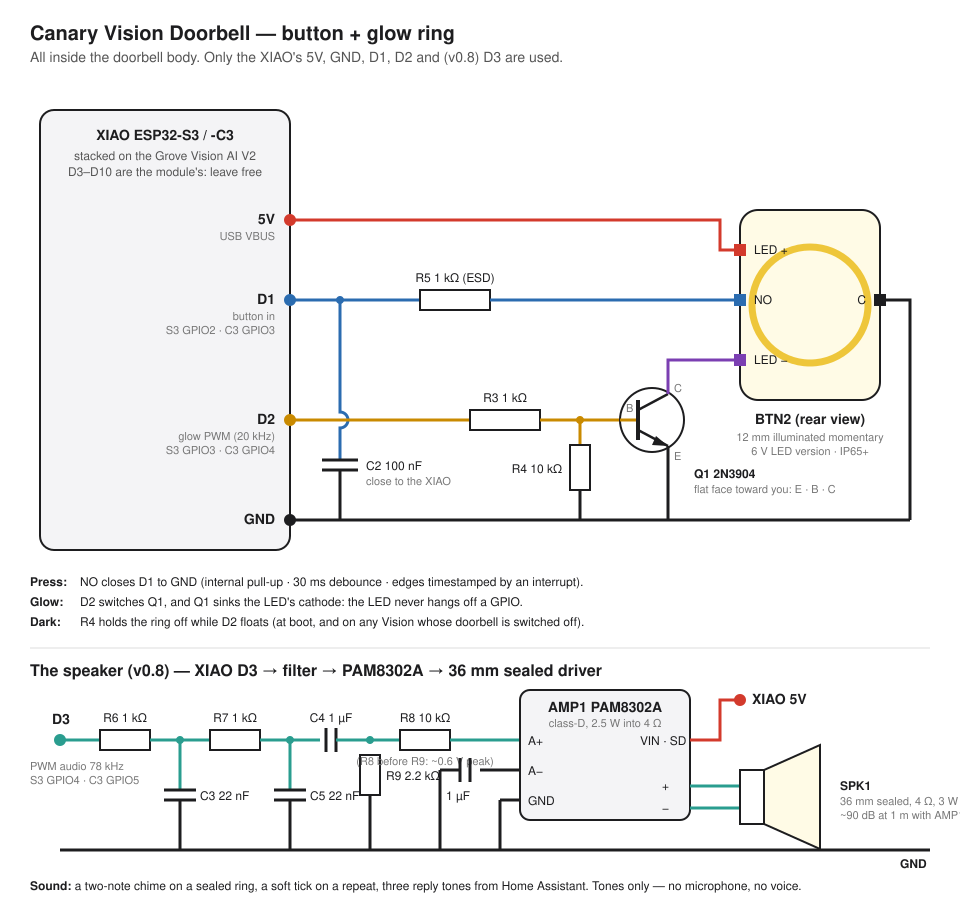

# Canary Vision Doorbell — button and glow ring: wiring, parts, firmware

**Status:** the firmware is written and its logic is host-tested
([`test_doorbell_logic.cpp`](../../firmware/tests_host/test_doorbell_logic.cpp));
the CI firmware builds compile it for both XIAO hosts. **It has not been
bench-tested on a real doorbell yet**, and none of the timings below is a
measurement. This page is the wiring for the released
[Vision Doorbell case](./enclosure/canary_vision_doorbell.scad) (the
**Lite** tier of the [doorbell dossier](./canary_doorbell_research.md)).

## What it does

| You do | The doorbell does |
|---|---|
| Press the button | Seals a `doorbell` event into the witness's signed chain (with the network down too), then the ring **swells** up and eases back and the speaker plays the **chime** (two bell notes, high then low): "the house heard you". A ring the witness could not seal (no identity yet) still goes out, unsigned, and gets the soft **tick** instead of the chime: heard, not claimed sealed. Home Assistant gets a real doorbell event; every Canary display on the broker shows *Doorbell heard*. |
| Press again within 3 s | Counted, not sealed and not re-announced: one impatient visitor is one ring, and nobody can flood the record by jabbing. The speaker gives one soft **tick** ("still heard, still one ring"). A press after 3 s rings again. |
| The household answers | From Home Assistant, the **Doorbell reply** select plays one of three short **tones** to the visitor: rising *we're coming*, falling *leave it*, a low double *no thanks*. Tones, never speech: a Canary has no microphone and renders no voice (the dossier's refusals, §3). |
| Hold it down | Still one ring. Held past 15 s (ice, tape, a jammed plunger), it's reported **stuck** once; the ring goes steady and low, and nothing rings until it's released. |
| Nothing | The ring **breathes**: the witness is on, nothing is being recorded. |
| The house's broker is unreachable | The ring breathes **slower and dimmer**. An empty log reads as "unsure", never as "quiet". Presses are still sealed on the device. |
| Switch the doorbell off in Home Assistant | The ring eases to dark. A dark ring means a doorbell that is off: brightness can't go below 10 % while it's on. |

The ring never flashes. That's enforced in code, not left to a setting: the
output slews at a bounded rate, so no mode change or swell can jump, and
the host test checks it frame by frame. The colors are the button's own
LED: yellow (canary) or warm white, never red or blue
([no impersonation](../research/harm_reduction_prior_art.md)).

**It turns itself on.** The doorbell starts switched off, and the first real
press switches it on (and rings). A plain Vision never sees a press, because
its D1 just idles on the pull-up, so it never grows doorbell entities. You
can also flip the **Doorbell enabled** switch in Home Assistant.

### In Home Assistant

These appear on the Vision's device page through MQTT discovery; no
integration update is needed:

| Entity | Kind | What it's for |
|---|---|---|
| **Doorbell** | `event` (device class `doorbell`) | Fires `press` once per sealed ring. Use it as an automation trigger: ring a smart chime, send a phone notification, turn on the porch light. HA's HomeKit bridge can expose it as a doorbell. |
| **Doorbell enabled** | `switch` (config) | Turns the doorbell (button + ring) on and off. |
| **Doorbell glow** | `number` 10–100 % (config) | Brightness of the ring. |
| **Doorbell button** | `sensor` (diagnostic) | `ok`, `stuck`, or `ring_fault` (the glow timer could not start: the ring holds a steady glow instead of breathing, so it still never reads dark while on). |
| **Doorbell volume** | `number` 0–100 % (config) | The speaker: the chime on a sealed ring, the tick on a repeat or an unsigned ring, the reply tones. 0 is silent; the ring still swells. |
| **Doorbell reply** | `select` | `we're coming` / `leave it` / `no thanks` — a tone to the visitor, played once when selected. The state row's `speaker` field says `ok` or `fault` (the sample timer could not start: silent). |

While the doorbell is off, only the switch exists. The other three are
removed, so a Vision that isn't a doorbell doesn't show doorbell controls.

## Parts

All in [`bom_canary_vision.csv`](./bom_canary_vision.csv), items 19–19e:

| Ref | Part | Notes |
|---|---|---|
| BTN2 | 12 mm illuminated momentary button, short body, IP65+, **6 V LED version** | Separate LED +/− terminals and a normally-open (NO) switch with its common (C). Yellow suits the canary; any color works. Buy the **6 V** LED version, which has its own resistor. A **3 V** version needs a 100 Ω resistor in series with LED +. Body and terminals ≤ 18 mm behind the panel (the case asserts it). |
| Q1 | 2N3904 NPN, TO-92 | Low-side switch for the ring. Any small NPN works (BC547, 2N2222, MMBT3904). |
| R3 | 1 kΩ | XIAO D2 → Q1 base. |
| R4 | 10 kΩ | Q1 base → GND: keeps the ring dark while D2 floats. |
| R5 | 1 kΩ | Button NO → XIAO D1: ESD protection for an outdoor metal button. |
| C2 | 100 nF ceramic | XIAO D1 → GND, at the XIAO end: noise filter (~0.1 ms, far below the 30 ms debounce). |

**The speaker** (v0.8 case, the zone between the button and the cable well):

| Ref | Part | Notes |
|---|---|---|
| SPK1 | 36 mm sealed full-range driver, 4 Ω, 3 W class, ≥ 88 dB/W/m, 6 mm deep | A mylar-cone driver with a plastic frame and a sealed back is what survives outdoors; the case seats its rim in a boss on the face over a foam ring and presses its magnet with a cradle on the plate, no screws. The **target** is a chime that carries over a busy street (70–75 dB at the curb); the arithmetic on this sensitivity and AMP1's 2.5 W says about 90 dB at 1 m before the grille, the mesh, the filter and the tone's own losses, **none of which has been metered yet** (see "What's not done"). Buy the sensitivity; the meter decides. Candidates to verify in hand (depth ≤ 6, rim ≤ 36): PUI AS03604MR-N50-R, CUI CMS-36T-28? — buy by the numbers, not the name. |
| AMP1 | PAM8302A class-D amplifier, 2.5 W into 4 Ω at 5 V (Adafruit 2130 breakout or bare) | Mono, single-ended input, fixed 24 dB gain, shutdown pin. Parks on edge against the −X wall beside the button, long side vertical, in the 18 mm between the bottom corner post and the speaker zone's first post (the case was probed with a 20 × 18 × 3 board there: it fits, snug). Its VIN is the XIAO's **5V** pin; SD ties to VIN (always on; idle draw is a few mA). |
| R6, R7 | 1 kΩ ×2 | The two-pole input filter with C3/C5: knocks the 78 kHz PWM carrier down ~40 dB before the amplifier. |
| C3, C5 | 22 nF ceramic ×2 | With R6/R7: ~7 kHz corner, twice. |
| C4 | 1 µF film or ceramic | Couples the audio to A+ and blocks the PWM's mid-scale DC (the speaker never sees it). |
| R8, R9 | 10 kΩ / 2.2 kΩ | A divider after C4: the XIAO's 3.3 V swing at the amp's 24 dB gain would clip; this leaves ~0.6 V peak, which is full output. |
| FOAM2 | foam ring Ø36 / Ø30 × 1.5 (compresses to 1.0) | Between the driver's rim and the face, inside the boss: it is the acoustic seal and the thing that lets the plate press the driver without rattles. |
| FOAM3 | foam pad Ø20 × 1.5 | Between the magnet and the plate's cradle. |
| MESH1 | acoustic mesh patch Ø34, hydrophobic (Saati Acoustex or the "waterproof speaker mesh" kind), adhesive | On the face's **inner** side over the grille, in its 0.3 mm seat: rain stays out, sound goes through. |

Plus about 20 cm of thin stranded wire, solder and heat-shrink.
Everything fits in the body's button zone and cable well. Sleeve Q1, R3
and R4 together in one piece of heat-shrink and park them in the well;
the amplifier and its filter parts go on edge beside the button, long side vertical, between the posts.
Turn the button's wires toward the well (up, in the mounted case), not
toward the bottom wall: the security screw's boss sits there.

Two more parts live in the v0.7 case beside the module, both optional:

| Ref | Part | Notes |
|---|---|---|
| BT2 | LiPo 802030 class, 8 × 20 × 30 mm, 400–450 mAh, **protected**, JST-PH leads | Stands on edge in the bay on the −X side, on the FT1 foam strip. Ride-through for a USB supply that browns out — for the record and the glow, **not the speaker** (AMP1 hangs off the USB-only 5V pin; see its wiring row). The XIAO charges it: the C3's ~370 mA is under 1C on this cell (the one size in the 20 × 30 family that is); the S3 charges at 100 mA. **Neither XIAO charger stops below 0 °C**, so in a freezing climate leave it out ([cold-weather envelope](./cold_weather_envelope.md)). |
| ANT1 | FPC Wi-Fi antenna, 40 × 20 mm, u.FL pigtail | The XIAO ESP32-C3 kit's own antenna (Seeed 318020748); the S3's 37.4 × 17.5 A-02 fits the same landing. Sticks to the +X wall inside the face, between two ribs; the pigtail runs under the module to the XIAO's u.FL. |

## Wiring

| From | To | Why |
|---|---|---|
| XIAO **5V** | BTN2 **LED +** | The ring runs from 5 V, not from a GPIO. |
| BTN2 **LED −** | Q1 **collector** | Q1 switches the ring's ground side. |
| Q1 **emitter** | **GND** | |
| XIAO **D2** | R3 → Q1 **base** | 20 kHz PWM, no flicker and no audible whine. |
| Q1 **base** | R4 → **GND** | Dark at boot and whenever the doorbell is off. |
| XIAO **D1** | R5 → BTN2 **NO** | The press pulls D1 low (internal pull-up). |
| XIAO **D1** | C2 → **GND** | Next to the XIAO. |
| BTN2 **C** | **GND** | |
| XIAO **D3** | R6 → C3 to GND → R7 → C5 to GND → C4 → R8/R9 divider → AMP1 **A+** | 10-bit PWM at 78 kHz carrying 8 kHz audio; the filter leaves the audio, the cap drops the DC, the divider matches the amp's gain. |
| AMP1 **A−** | 1 µF to **GND** | The amp's input is differential; A− rides at its own bias through the cap. |
| XIAO **5V** | AMP1 **VIN** (and **SD**) | 2.5 W peak on the chime; the USB supply covers it. **The 5V pin is USB only on both XIAOs**: on the LiPo (USB out) it reads 0 V, so the speaker is silent during a ride-through while the ring still seals and the glow still swells (the 3V3 rail stays up). Feeding AMP1 from 3V3 instead is not the fix: the XIAO's 3.3 V regulator cannot carry the module *and* a watt of chime, and the amp would make ~1 W. A battery-backed 5 V rail for the amp is a v0.9 question, if the chime must ring through an outage. |
| AMP1 **GND** | **GND** | |
| AMP1 **+ / −** | SPK1 **+ / −** | The sealed driver behind the grille. |

2N3904 pins, flat face toward you, legs down: **E · B · C**.

Pin numbers by board:

| XIAO pad | XIAO ESP32-S3 | XIAO ESP32-C3 | Role |
|---|---|---|---|
| D1 | GPIO2 | GPIO3 | button in |
| D2 | GPIO3 | GPIO4 | glow PWM |
| D3 | GPIO4 | GPIO5 | speaker PWM (v0.8) |

D3 is the module socket's SPI chip-select line. The Vision firmware never
runs SPI to the module (it talks I²C), and a chip select that wiggles while
SCK and MOSI stay idle clocks no byte into the module's SPI slave, so the
pin is free to carry the audio. That was the last spare header pin on the
stacked build; `firmware/boards/PIN_BUDGET.md` now shows both XIAO hosts
with D1, D2 and D3 committed to the doorbell.

D1 and D2 are used because the Grove Vision AI V2's socket owns the rest of the
header: D4/D5 (I2C, which this firmware uses), D6/D7 (UART) and the SPI
group D8–D10 with chip select on D3 (unused by this firmware, but wired to
the module). **Check once before you solder:** with the XIAO removed, put a meter
in continuity mode between the module socket's D1 and D2 pads and each of
its other pads. Neither should beep to anything except where you expect.
If your board revision differs, the pins live in one place each,
`DOORBELL_BUTTON_PIN` / `DOORBELL_GLOW_PIN` in
[`firmware/boards/xiao-esp32s3/pins/pins.h`](../../firmware/boards/xiao-esp32s3/pins/pins.h)
and [`xiao-esp32c3/pins/pins.h`](../../firmware/boards/xiao-esp32c3/pins/pins.h).

On the XIAO ESP32-S3, D2 is GPIO3, a strapping pin (the JTAG source select).
It only counts when an eFuse no stock XIAO has burned is set, and R3 + R4
hold it low at reset anyway, so the glow drive is safe there. The firmware
leaves the pin high-impedance until the doorbell is on.

On the XIAO ESP32-C3, D1 is also that board's `EXT_LED_PIN_DEFAULT`. Nothing
in the Vision firmware uses it, but don't hang a status LED there on a
doorbell.

## Power

As designed, the doorbell runs from **USB-C**: a right-angle plug out
through the back plate's 14 × 10 oval exit (BOM GRM1) and the wall plate's
slot to a 5 V supply. That's the tested path for the Vision stack. The
well is sized for a molded right-angle head up to 13 mm long off the
XIAO's port; a straight plug does not fit a doorbell.

**The battery bay** (v0.7 case, BOM BT2) holds a protected 802030 LiPo as
ride-through, not as the supply: the Vision stack draws too much to live
on 400 mAh, and a LiPo outdoors in winter is the problem the
[cold-weather envelope](./cold_weather_envelope.md) spells out. Solder the
cell's leads to the XIAO's **BAT+ / BAT−** pads before you seat the XIAO
in the module (the pads are on the side that faces the module), run the
leads out under the XIAO into the bay, and set the cell in on edge with
its leads toward the well. The firmware does nothing special for it: the
XIAO's charger charges, the XIAO's regulator switches over. Leave the bay
empty where it freezes.

**Using the existing doorbell wires.** A doorbell button is usually fed by
a 16–24 V AC transformer. To power the Canary from it, put a doorbell-to-USB
converter behind the plate: an AC-input module rated for 8–24 V AC in, 5 V
≥ 1 A out. Two things to know:

- The old **mechanical chime will not ring** from the button any more,
  because the wires now carry power, not a switch. Ring your house instead
  through Home Assistant (the **Doorbell** event → a smart chime, a speaker,
  or a relay across the old chime's terminals). The Pro tier's carrier
  board puts that chime relay on the doorbell itself (dossier §8); the Lite
  doesn't have one.
- Keep the converter outside the sealed body or in its own sealed box. The
  body's cavity is sized for the Vision stack and the button.

## Bring-up

1. Flash the Vision firmware (XIAO S3 or C3 build) as usual.
2. Open the serial console. At boot a `[BELL]` block says
   `Doorbell off - the first press turns it on (button D1, glow D2, glow 60%)`.
3. Press the button: `[BELL] Doorbell on.`, then a `[BELL]` block with
   `Ring (pressed at … ms, sealed)`. The ring swells, then settles into a
   slow breath.
4. In Home Assistant, the **Doorbell** event shows `press`. Unplug the
   broker and the breath slows and dims; press again and it still swells
   (the press is sealed on the device).
5. Hold the button for 15 s: `[BELL] … reported stuck`, and the ring goes
   steady and low. Release it: `[BELL] Button released - no longer stuck.`
6. The speaker: boot prints `[BELL] Speaker on D3 (PWM 78125 Hz, 10-bit,
   8000 samples/s), volume 60%`. A press plays the chime with the swell; a
   second press inside 3 s plays the tick, and so does a press before the
   witness has an identity (the serial line says `unsigned`). Set **Doorbell
   volume** to 100 and stand at the curb with a sound-level meter: the chime
   should carry over traffic, and the reading is the number this page is
   missing. Send a
   **Doorbell reply** and the matching tone plays once. No sound at all with
   `speaker: fault` in the state row means the sample timer did not start;
   no sound with `speaker: ok` is the wiring (check the 5 V at AMP1 VIN and
   the ~0.6 V peak at A+ on a scope while a reply plays).

If step 3 does nothing, check the button with a meter: NO and C should
close when pressed. D1 should read ~3.3 V released and ~0 V pressed.

## How it compares with Ring

What this doorbell **does**, all on the house's own network and with no
subscription:

- The press is a **signed, hash-chained record** on the device, sealed even
  with the network down. A Ring press is a cloud event.
- It **tells the house locally**: Home Assistant, every Canary display on
  the broker, and any automation you write. No WAN round-trip is in that
  path. "Under a second" is the dossier's design target (§4.5, open item
  14), and **nobody has measured it yet**.
- The ring is **honest**: it breathes while the witness is on, breathes
  differently when the hub is gone, swells only for a sealed press, and is
  dark only when the doorbell is off.
- It's **open**: you can read every line that decides what a press does.

What it **refuses**, by design (dossier §3): live view, recorded clips,
faces, and two-way audio. A Canary is a witness, not a camera feed. If you
need to see who's at the door, this isn't that product, and the dossier
explains why.

## What's not done

- **Bench validation**: nobody has pressed a real one yet. The host test proves the logic
  (and the voice: every phrase starts and ends in silence, never clips, reaches full scale);
  CI compiles the firmware; a bench unit is the next step. **No loudness has been measured.**
  The ~90 dB at 1 m this page mentions is arithmetic on the driver's rated sensitivity and
  the amplifier's power, before the grille, the mesh, the input filter and the tone's own
  losses; it is a target, not a claim. A sound-level meter at the curb is the test, and the
  measured number replaces the arithmetic on this page when it has been read.
- **The chime is silent on battery.** AMP1 runs from the XIAO's 5V pin, which is USB only on
  both hosts; during a LiPo ride-through the ring still seals and the glow still swells, but
  nothing plays. A battery-backed 5 V rail for the amplifier is a v0.9 question.
- **Quick replies in a voice** (the dossier's §4.3: the hub's Piper voice rendering "leave
  it by the bench") are the Pro's; the Lite's replies are the three tones. The firmware's
  phrase table is the one place to add a fourth.
- **The fleet beacon** (the broker-free BLE / ESP-NOW channel the displays
  also listen on) carries object classes, not a doorbell press. A press
  reaches the displays through the broker, not broker-free. Adding a press
  to the beacon is a wire-format change across the display firmware, the
  Lab and the Apple apps.
- **Displays say "Doorbell heard"**: the same row the WAP's acoustic
  doorbell detector already uses.
- **Measure the module's mounting holes.** The v0.7 case puts a screw post
  under each of the Grove Vision AI V2's two M2 holes at ±7.5 / +2.5 mm from
  the module's center, read off a photo of the first print; the vendor CAD
  carries no holes. Calipers before the next print (`vm_hole_dx` /
  `vm_hole_dy`), and the seat lift `vm_seat_lift` with them.

## Where the code is

- [`firmware/common/doorbell/doorbell_logic.h`](../../firmware/common/doorbell/doorbell_logic.h): the
  decisions (debounce, holdoff, stuck, glow curves, the slew limit), pure and host-tested.
- [`firmware/projects/canary-vision/src/doorbell.cpp`](../../firmware/projects/canary-vision/src/doorbell.cpp): pins, the edge
  interrupt, LEDC PWM, NVS settings.
- [`firmware/projects/canary-vision/src/main.cpp`](../../firmware/projects/canary-vision/src/main.cpp): seal, swell, announce.
- [`firmware/projects/canary-vision/src/ha/ha_discovery.cpp`](../../firmware/projects/canary-vision/src/ha/ha_discovery.cpp): the four Home Assistant entities.
