# Canary — 3D-Printable Enclosures

Printable housings, mounts and workshop tools for every SecuraCV **Canary**
witness device. Everything is a parametric [OpenSCAD](https://openscad.org)
"configurator": open a `.scad`, tick the options that match *your* hardware,
and the model rebuilds itself. Ready-to-print STLs for the common
configurations are committed next to the sources — **click any `.stl` link
to spin it in GitHub's 3D viewer, no download needed.**

## New here? Your first hour

You need: a filament printer (PETG recommended), the boards for whichever
Canary you're building (see the [hardware guide](../README.md)), and 4× M2
screws per case. Then:

1. **Print the [fit coupon](./canary_fit_coupon.scad)** (one small plate). Its
   labeled stations test every fit used across this folder; if a station is
   tight or loose it names the parameter to adjust. Calibrate once, reuse for
   every part below.
2. **Pick your case** from the [variant gallery](#pick-your-variant) —
   released variants have committed STLs; slice and print (flat, open side
   up, no supports — ever). New to slicing these? The
   [PETG Cura guide](./printing_petg_cura.md) has a settings sheet and a
   one-click profile.
3. **Fit your boards** — every case uses the same snap-clip cradles: boards
   press in, no screws. Each device section below has its assembly steps.
4. **Mount it** — print the wall bracket / plate for your case, or print a
   [paper template](#the-complete-file-map) at 100 % and drill from that.

Going **outdoors**? Read [Weather mode](#weather-mode-opt_seal) and the
[Engineering & materials](#engineering--materials-security-build) section
before printing — material choice and the gasket option matter out there.

**No OpenSCAD installed?** The released cases can be tweaked and rendered
**in the browser** at [securacv.com/builder](https://securacv.com/builder) —
the same parametric sources with the common options as dropdowns, running
OpenSCAD compiled to WebAssembly locally (nothing is uploaded). The page's
manifest is generated from these files by
[`gen_builder_manifest.py`](./gen_builder_manifest.py); CI fails if it
drifts, and `./gen_builder_manifest.py --site <website-checkout>` refreshes
the website's carried copies after a CAD change.

## Table of contents

- [The complete file map](#the-complete-file-map) — every file, one line each
- [Pick your variant](#pick-your-variant) — gallery with previews + 3D viewers
- [Engineering & materials](#engineering--materials-security-build) — durability, materials, thermal kit, finish
- [Best-practice printing tips](./printing_best_practices.md) — the *why* behind a good print: strength, fit, finish, durability (slicer-agnostic)
- [Printing in PETG — Cura guide](./printing_petg_cura.md) — reasoned settings sheet, per-model cheat-sheet, importable profile
- [Printing in PETG — Bambu Studio / Orca guide](./printing_petg_orca.md) — the same sheet for the slicer the market-leading machine ships, plus a Cura↔Orca name map and the four stock-preset rows that are wrong for this catalog
- [Bambu Lab P2S bring-up](./bambu_p2s_bringup.md) — new machine to a part you trust: coupon → record your numbers → a released case → the 7" gauge → the 7" slab
- [Which printer to buy or support](./printer_selection.md) — what these parts actually demand, upfront vs running vs maintenance cost, and the decision
- [Field & environmental ratings](./field_ratings.md) — what "IP67"/"MIL-SPEC" honestly means here, the CER ladder + home test protocols
- [Catalog architecture](./CATALOG_ARCHITECTURE.md) — how models, versions, flavors, options, fit, and remixes are organized, and how a user picks the right case (the selection UX)
- [Audit, 2026-09](./AUDIT_2026_09.md) — an eleven-dimension design audit of every `.scad` here (ribs, drop, weather, openings, clearances, printability, assembly, repairability, parametric UX, aesthetics): what was found, what was fixed, and what is still open — each finding proved by a rendered probe rather than by reading a comment
- Device deep-dives: [WAP](#canary-wap--enclosure-v07) · [Vision](#canary-vision--enclosure-v02) · [Doorbell](#canary-vision--doorbell-v01) · [Sense radome](#canary-sense--radome-enclosure-v01)

## The complete file map

**The four devices** (released — committed STLs, print-validated pipeline):

| File | What it makes |
|------|----------------|
| [`canary_wap_enclosure.scad`](./canary_wap_enclosure.scad) | **Canary WAP** box (XIAO ESP32-S3 Sense): peripheral bays for battery/GPS/buzzer/LED, three one-click presets, opt-in weather seal + wall mounts |
| [`canary_vision_enclosure.scad`](./canary_vision_enclosure.scad) | **Canary Vision** camera unit (Grove Vision AI V2 + OV5647): GoPro-compatible tilt hinge with locking detents, wall bracket + thumbscrew knob |
| [`canary_vision_doorbell.scad`](./canary_vision_doorbell.scad) | **Doorbell** form of the Vision build (Ring/Wyze size): camera + lit button, wedge-able wall plate, hidden security screw |
| [`canary_sense_enclosure.scad`](./canary_sense_enclosure.scad) | **Canary Sense** radar witness (MR60BHA2 + XIAO C6): the front is a thin RADOME window the 60 GHz beam passes through |

**In development** (geometry verified, not yet print-validated — render from
the `.scad`, no committed STLs; see the [dev gallery](#in-development)):

| File | What it makes |
|------|----------------|
| [`canary_watch_station.scad`](./canary_watch_station.scad) | Desk **monitoring puck** for the round-display XIAO stack ([display research](../display_research.md)) |
| [`canary_sense_stand.scad`](./canary_sense_stand.scad) | Weighted **bedside stand** for the Sense unit (wellbeing channel) |
| [`canary_sense_gang.scad`](./canary_sense_gang.scad) | **In-wall flush mount**: a single-gang faceplate that IS the radome |
| [`canary_outlet_cradle.scad`](./canary_outlet_cradle.scad) | **Outlet cradle**: hang any case off a USB wall adapter, zero hardware |
| [`canary_relay_solar.scad`](./canary_relay_solar.scad) | **Solar LoRa relay pod** for off-grid mesh backhaul (pole-mounted) |
| [`canary_combo.scad`](./canary_combo.scad) | **Radar + camera combo** witness in one housing |
| [`canary_hub_din.scad`](./canary_hub_din.scad) | **Server hub**: vented Raspberry Pi 5 box with a DIN-rail clip |
| [`canary_jbox.scad`](./canary_jbox.scad) | **Covert shell** styled as a utility junction box (lawful use; pair with the sign) |
| [`canary_sign.scad`](./canary_sign.scad) | **Witness signage plate** — "presence sensing in use, no video stored" |
| [`canary_hammond_chassis.scad`](./canary_hammond_chassis.scad) | **Chassis plate** carrying any Canary stack inside the off-the-shelf Hammond IP66 box |
| [`canary_mount_adapters.scad`](./canary_mount_adapters.scad) | **Mount adapters**: corner wedge, magnet plate, pole plate, drill template — all on the shared stud interface |
| [`canary_field_case.scad`](./canary_field_case.scad) | **Field case**: GoPro-class rugged witness — O-ring sealed, no external ports, TPU impact boot; the only CER‑4 (IP67 + drop) intent design ([ratings](./field_ratings.md)) |
| [`canary_dash_display.scad`](./canary_dash_display.scad) | **Dashboard display case** for the Waveshare 4.3" touch panel ([display research](../display_research.md) Option B): bezel frame, vented back with keyholes + 75 mm pair, desk stand |
| [`canary_vehicle_mount.scad`](./canary_vehicle_mount.scad) | **Vehicle mounts**: VHB dash plate (10° riser) + air-vent louver clip, on the shared stud interface — USB power only, no batteries on a hot dash. Pairs with [Canary Vehicle](../canary_vehicle_can.md)'s passive CAN bus witness (arrival/departure claims) |
| [`canary_wear_clip.scad`](./canary_wear_clip.scad) | **Body-worn carry**: belt leaf-spring clip + MOLLE/PALS adapter for the field case (or any keyhole case) |
| [`canary_vision_pro_mount.scad`](./canary_vision_pro_mount.scad) | **Vision Pro mount**: bridges a reCamera Pro onto the shared stud interface — keyhole back, 1/4"-20 tripod counterbore and/or magnet pocket front (reCamera's confirmed mount options) |

**Workshop tools** (print/use alongside any build):

| File | What it makes |
|------|----------------|
| [`canary_fit_coupon.scad`](./canary_fit_coupon.scad) | **Print first**: one coupon that calibrates every fit in this folder |
| [`canary_bench_fixture.scad`](./canary_bench_fixture.scad) | Labeled **bring-up plate** holding the XIAO + buzzer/LED/button/reed while you wire and test ([bench guide](../bench_bringup.md)) |
| [`canary_dock.scad`](./canary_dock.scad) | Numbered **provisioning dock** for flashing a fleet of XIAOs in order |
| [`canary_inserts.scad`](./canary_inserts.scad) | Small **glue/press-in parts**: buzzer horn, anti-glare ring, printed cable gland |
| [`canary_mark_lib.scad`](./canary_mark_lib.scad) → [`securacv_bird_glyph.svg`](./securacv_bird_glyph.svg) | **The house mark** — the Canary bird as printable geometry, plus the bird-over-wordmark lockup. Authored as stroked paths, not traced artwork (the brand line work is ~0.08 mm wide at badge size and no nozzle lays that down), so the mark is re-drawn at whatever weight a given part can actually print, and has a `fill` mode for the solid brand form. One bird for the whole line; `canary_fit_coupon.scad` is where its printability gets proven, not where it is defined. The shipped vector art is **generated from it** — run [`gen_mark_svg.py`](./gen_mark_svg.py) after any path edit, or CI's `--check` will say so. Not a printable part |
| [`canary_vent_lib.scad`](./canary_vent_lib.scad) | **The brand vent pattern** — hatchery grille: upright eggs in offset rows, a clutch in a nest. `use` it wherever a case vents a field; exact open-area maths included. The tip ratio is the line-wide constant and lives here, so changing it moves every adopter at once. Not a printable part |
| [`canary_core_lib.scad`](./canary_core_lib.scad) | **The shared geometry vocabulary** — `rrect2d` and friends (once, instead of 26 copies), the teardrop bore, the two-stage soft edge, the foot chamfer, flat-vs-90° screw seats chosen by the head in the bag, and the FDM process floors (extrusion/web/wall) as functions. Not a printable part |
| [`canary_mount_lib.scad`](./canary_mount_lib.scad) | **The stud/keyhole hanging interface** — the Ø4/Ø6.6 T-stud and its blind keyhole pocket as one contract with the mating arithmetic asserted (stem = face web + slide room; 0.1 ceiling clearance; the click detent's 0.15 squeeze). Six stud drawings and eight pocket drawings became this file. Not a printable part |
| [`canary_snap_lib.scad`](./canary_snap_lib.scad) | **Snap-fit engineering** — the cantilever beam strain formula as an assert (with once/cycle budgets), the WAP board clip verbatim, and the C3's derived-window rule (`snap_window`): one number cannot size a ridge and its window. The math that used to live in one file's comment now gates every adopter. Not a printable part |
| [`canary_port_lib.scad`](./canary_port_lib.scad) | **Connector openings** — the WAP's bridge-safe chamfered-top profile, USB-C stadium vs series-A rectangle (shape follows shell; the standard is not a knob), and the 11.0 mm insertion-length floor as a shared assert. Not a printable part |
| [`canary_board_lib.scad`](./canary_board_lib.scad) | **The board registry** — every module the catalog mounts, with the panel-lib evidence ladder (measured / drawing / spec / unmeasured) and the measured facts that used to live in one file each (the XIAO's real 17.8 width, the 6.5 seated-stack height, the Grove's 40 × 20). Not a printable part |
| [`canary_color_lib.scad`](./canary_color_lib.scad) | **The colorway registry** — the spool palettes (body / ink / light per colorway, lowercase sRGB hex) every consumer reads from one home: the Customizer previews, the builder manifest carry, the website's AR variant picker and showroom finishes. The self-check enforces the doctrine (ink contrasts its body; the light role is near-white or a printed band reads switched-off). Not a printable part |
| [`canary_cradle_lib.scad`](./canary_cradle_lib.scad) | **The click-on wall dock** — a plate takes the wall screws and the case snaps onto it, thermostat-style: two rigid T-studs (the catalog's existing stud/keyhole standard) carry the weight, two sprung clips hold the bottom in, and the case pulls off for service without touching the wall. The clip arms are **cut into the plate** so they bend in the print plane — a snap arm standing off a flat-printed plate flexes across its layer bonds and breaks. Shared by the 7″ and the 4.3″; the feature geometry is fixed here so one plate fits any case at the same span. Not a printable part on its own — each case exports its own `part="cradle"` |
| [`canary_shop_tools.scad`](./canary_shop_tools.scad) | Heat-set **insert press guide** + doorbell button accent ring |
| [`canary_templates_2d.scad`](./canary_templates_2d.scad) → [studs](./template_studs.svg) · [bracket](./template_bracket.svg) · [doorbell](./template_doorbell.svg) | **1:1 paper drill templates** — print the SVG at 100 % (check the 20 mm square), tape to the wall, drill |
| [`canary_s3_lcd7_fitcheck.scad`](./canary_s3_lcd7_fitcheck.scad) | **Not a printable part** — renders the 7" bezel and tray in their *assembled* positions and intersects them, so CI can catch a case whose parts are each a perfect mesh but don't clamp anything. Collisions must be empty; the lip's bearing patch must not be |
| [`render.sh`](./render.sh) | Regenerates every STL, preview and SVG from source (CI runs it on every change) |

Everything shares one design language, so skills transfer between parts: the
same three **print-tolerance knobs** (`tol_slide`/`tol_press`/`tol_hole` —
the fit coupon tunes them), the same **snap-clip board cradles**, the same
**two-stud wall-hanging interface**, and the same opt-in **weather sealing**
(printed TPU gasket + drip-edge lid). A CI gate re-renders and mesh-checks
all ~60 parts on every change, so what's in this folder always builds.

## Pick your variant

One row per printable variant. **Every `.stl` link opens in GitHub's
interactive 3D viewer** — rotate and zoom it in the browser, no download
needed — and each preview shows the full printed set. Custom combinations
(other option mixes, `screw_insert`, labels…) render from the `.scad` in
minutes.

| Variant | For | Preview | Parts (click to view in 3D) |
|---------|-----|---------|------------------------------|
| **WAP · compact** | plain XIAO ESP32-S3, USB-powered, smallest box | 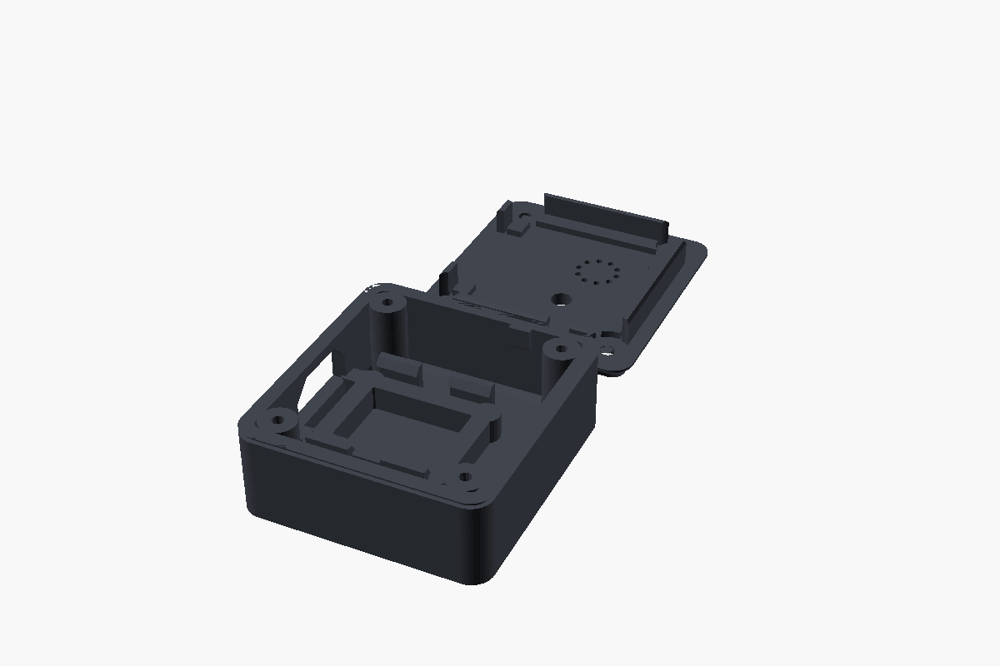 | [base](./canary_wap_enclosure_compact_base.stl) · [lid](./canary_wap_enclosure_compact_lid.stl) |
| **WAP · battery** | XIAO Sense camera + LiPo + GPS, indoor | 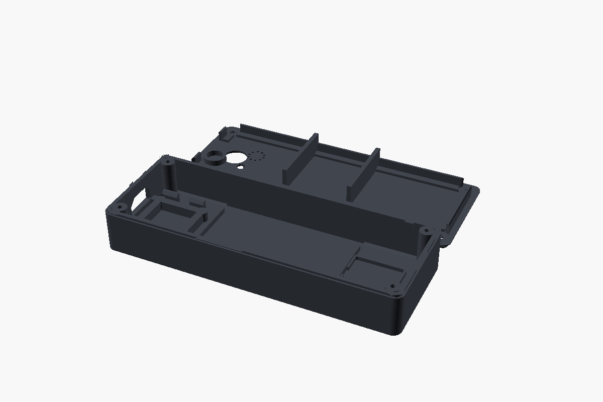 | [base](./canary_wap_enclosure_battery_base.stl) · [lid](./canary_wap_enclosure_battery_lid.stl) |
| **WAP · weather** | battery build + TPU gasket seal, drip-edge lid, keyhole mounts (CER‑2 / ~IP54 target — [ratings](./field_ratings.md)) | 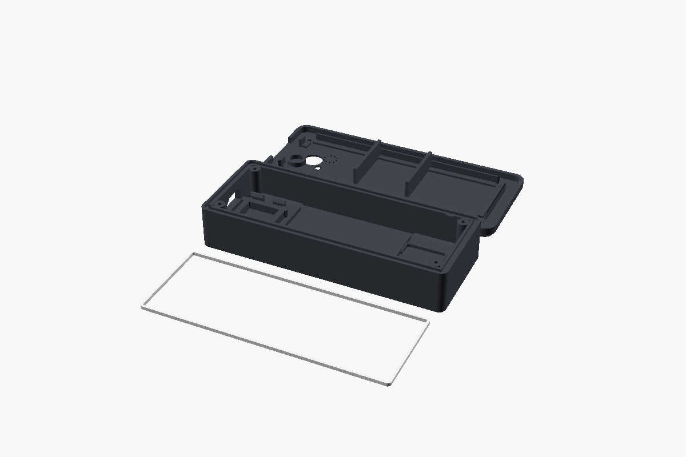 | [base](./canary_wap_enclosure_weather_base.stl) · [lid](./canary_wap_enclosure_weather_lid.stl) · [gasket](./canary_wap_enclosure_weather_gasket.stl) |
| **WAP · clip coupon** | **print first** — 15 min snap-fit tuner | 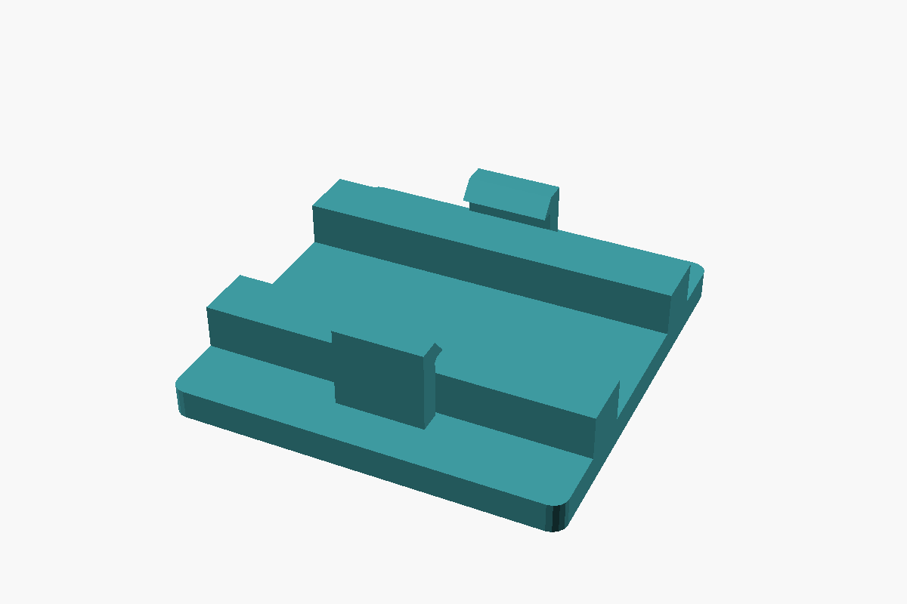 | [coupon](./canary_wap_enclosure_clip_coupon.stl) |
| **Vision · xiao indoor** | stacked XIAO host (recommended), hinge mount, desk/shelf | 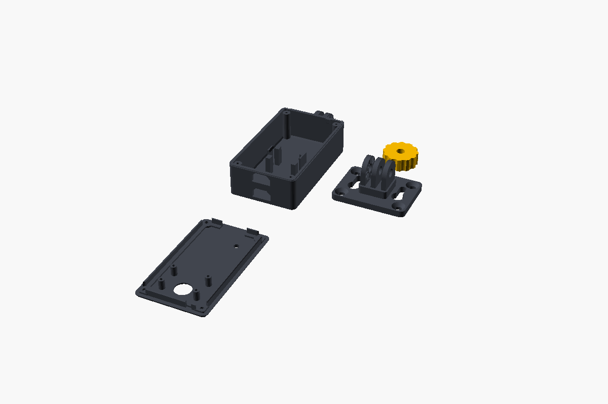 | [back](./canary_vision_enclosure_xiao_indoor_back.stl) · [front](./canary_vision_enclosure_xiao_indoor_front.stl) |
| **Vision · xiao weather** | stacked XIAO, sealed + rain hood + vent, hinge & keyholes | 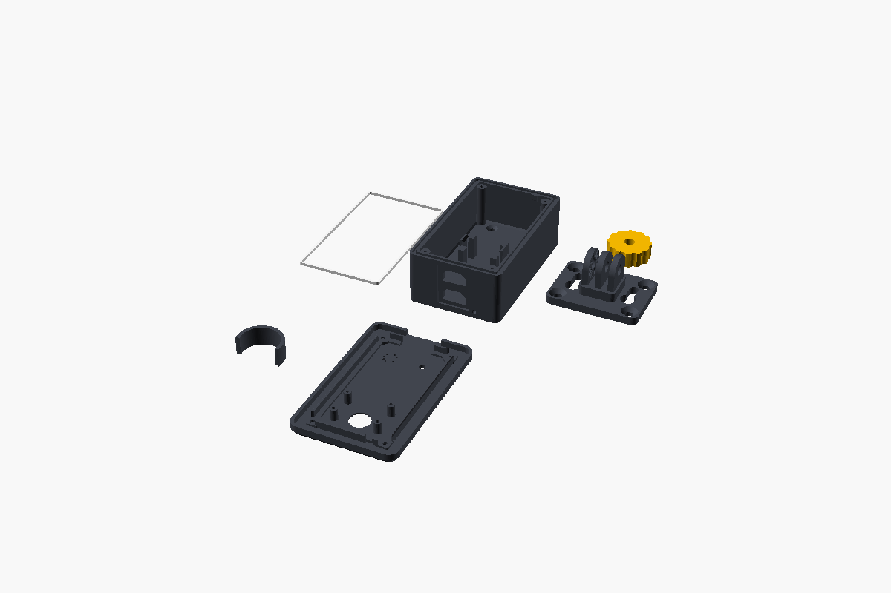 | [back](./canary_vision_enclosure_xiao_weather_back.stl) · [front](./canary_vision_enclosure_xiao_weather_front.stl) · [gasket](./canary_vision_enclosure_xiao_weather_gasket.stl) |
| **Vision · devkit indoor** | Grove-cabled ESP32-C3-DevKitM-1 host | 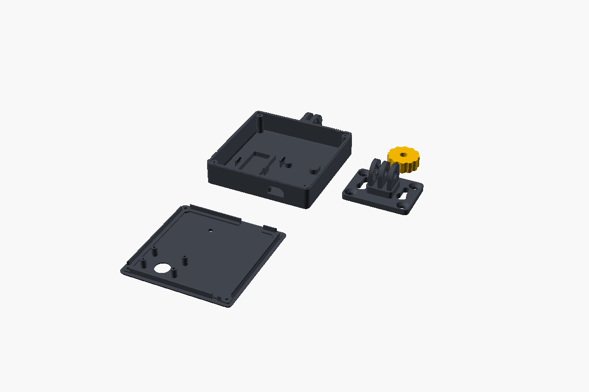 | [back](./canary_vision_enclosure_devkit_indoor_back.stl) · [front](./canary_vision_enclosure_devkit_indoor_front.stl) |
| **Vision · mount kit** | wall bracket (GoPro-prong, tripod nut) + M5 thumbscrew knob | 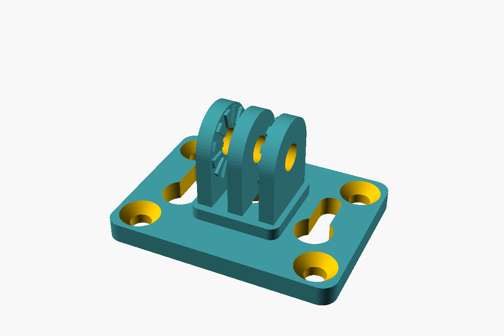 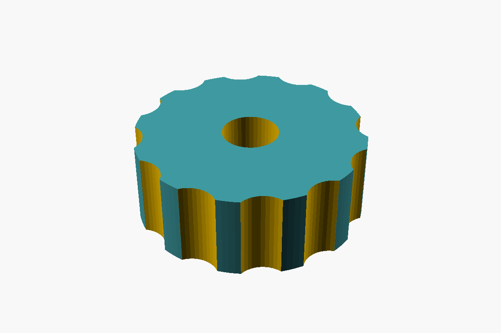 | [bracket](./canary_vision_enclosure_bracket.stl) · [knob](./canary_vision_enclosure_knob.stl) |
| **Vision · DOORBELL** | Wyze/Ring form factor: camera + button, plate-mounted with a hidden security screw, sealed by default | 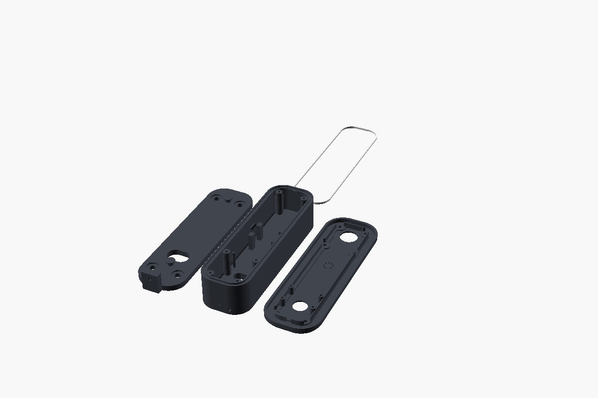 | [body](./canary_vision_doorbell_body.stl) · [face](./canary_vision_doorbell_face.stl) · [plate](./canary_vision_doorbell_plate.stl) · [wedge 15°](./canary_vision_doorbell_plate_wedge15.stl) · [gasket](./canary_vision_doorbell_gasket.stl) |
| **Sense · radome** | MR60BHA2 mmWave witness: thin radar window, hinge + keyholes (shares the Vision bracket/knob) | 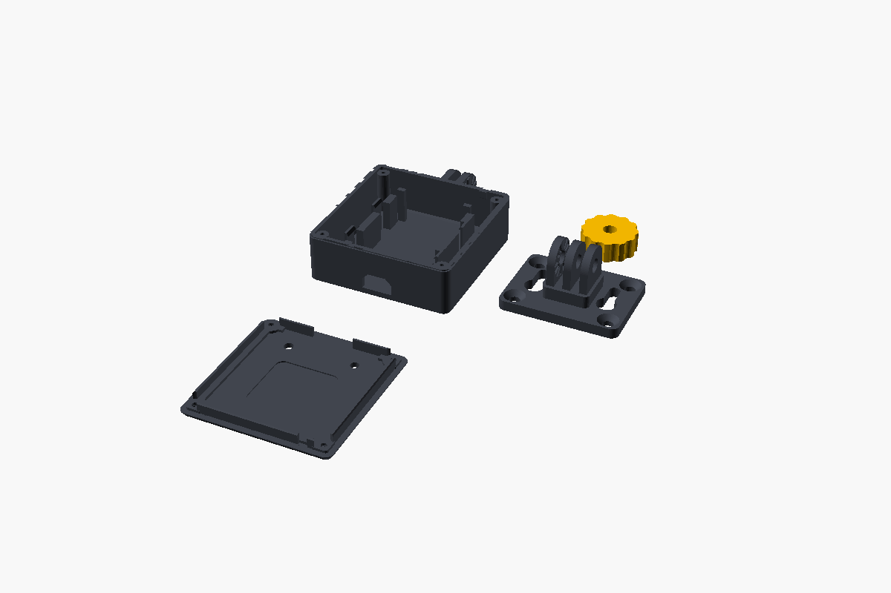 | [back](./canary_sense_back.stl) · [front](./canary_sense_front.stl) |
| **Thermal / outdoor kit** | solar radiation shield (weather WAP) + universal desiccant tray | — | [shield](./canary_wap_enclosure_weather_shield.stl) · [tray](./canary_wap_enclosure_tray.stl) |

### In development

These designs are **render- and mesh-verified but not print-validated** — no
committed STLs yet (CI still renders and checks them on every change).
Open the `.scad`, measure your hardware, and render locally; feedback and
measurements welcome.

| Design | Status | Preview | Source |
|--------|--------|---------|--------|
| **Watch station** — SenseCAP-Watcher-style desk puck: XIAO ESP32-S3 pinned into the Round Display's back socket (see [display research](../display_research.md)); v0.2 bore sized to the measured Ø43.0 disc, snap bezel (no fasteners), and a true cradle divot | drum + snap bezel + 25° cradle | 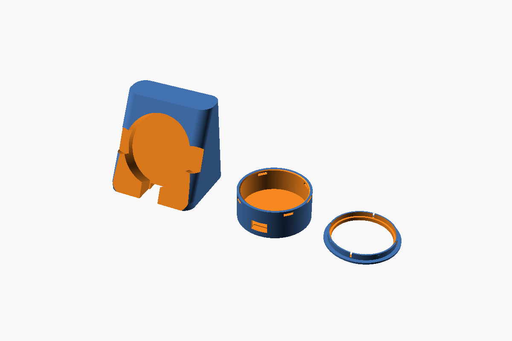 | [`canary_watch_station.scad`](./canary_watch_station.scad) |
| **Sense bedside stand** — weighted base + tilted stalk with the three-prong hinge head (wellbeing channel, ≤1.5 m) | ballast pockets, GoPro-compatible head | 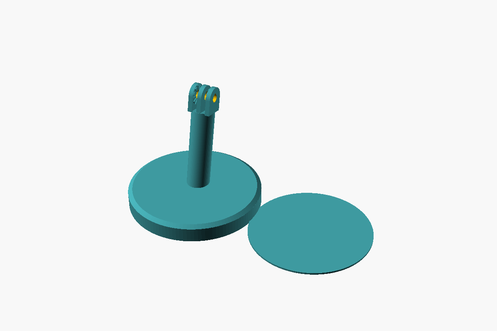 | [`canary_sense_stand.scad`](./canary_sense_stand.scad) |
| **Sense in-wall plate** — single-gang flush mount; the faceplate IS the radome (check local code; low-voltage box only) | one-piece plate, 6-32 slots | 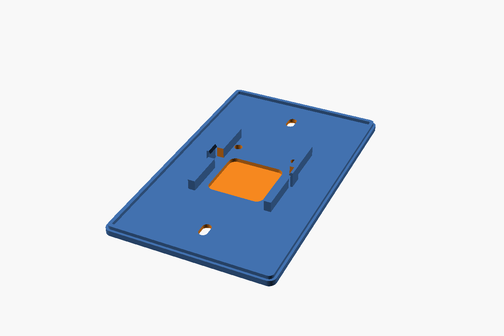 | [`canary_sense_gang.scad`](./canary_sense_gang.scad) |
| **Outlet cradle** — collar grips a USB wall wart; T-studs hang any keyhole-pocket Canary | measure your adapter | 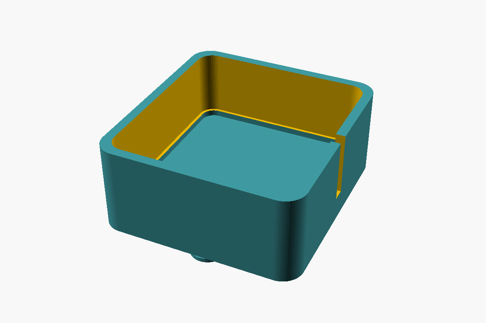 | [`canary_outlet_cradle.scad`](./canary_outlet_cradle.scad) |
| **Solar LoRa relay pod** — off-grid mesh backhaul: LoRa board + 18650, SMA top, solar roof bracket, pole straps | sealed body + roof | 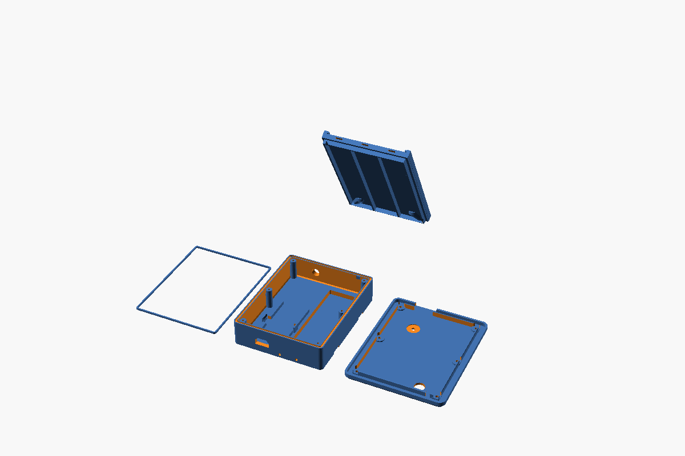 | [`canary_relay_solar.scad`](./canary_relay_solar.scad) |
| **Combo witness** — Vision + Sense stacks in one face (lens + radome); radar-confirmed camera events | dual column, 3 USB ports | 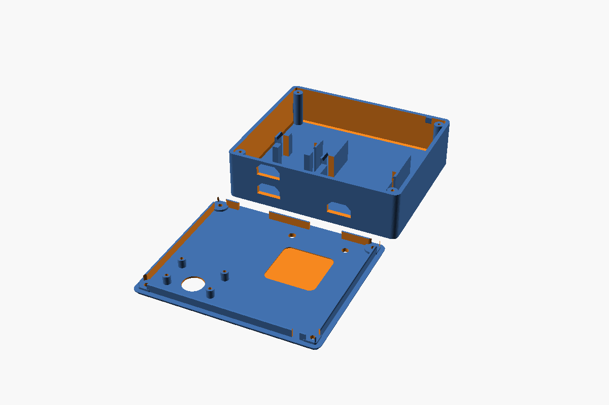 | [`canary_combo.scad`](./canary_combo.scad) |
| **Hub (Pi 5, DIN rail)** — vented tray + cover for the server side; printed DIN spring clip | chimney vents, HAT headroom | 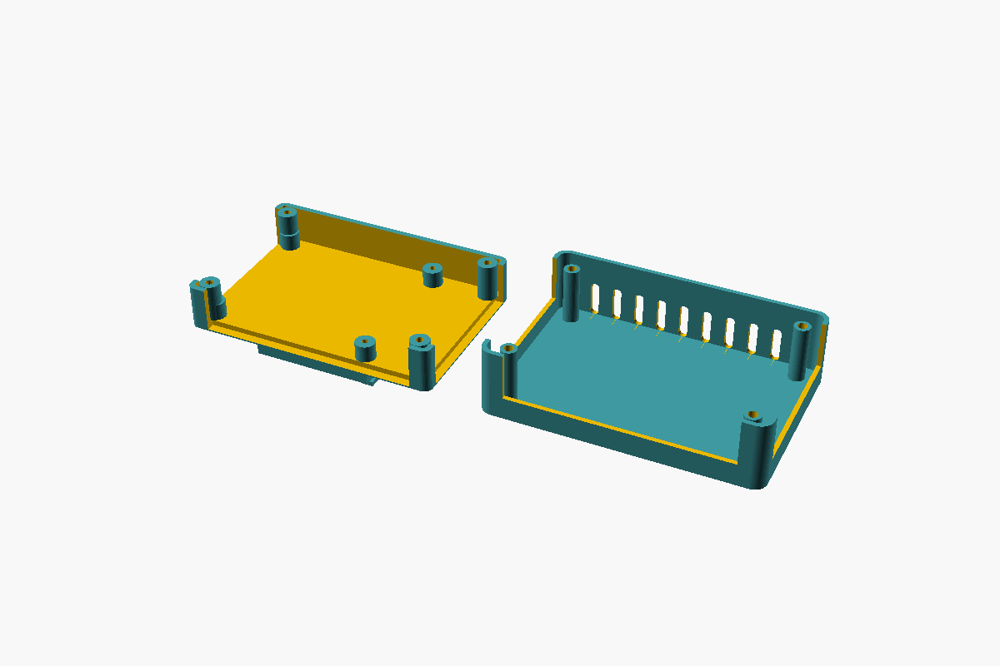 | [`canary_hub_din.scad`](./canary_hub_din.scad) |
| **Hammond chassis plates** — bring the Canary rail/clip cradles into the ENC1 polycarbonate route (`stack` = wap/vision/sense) | boss grid: MEASURE your box | 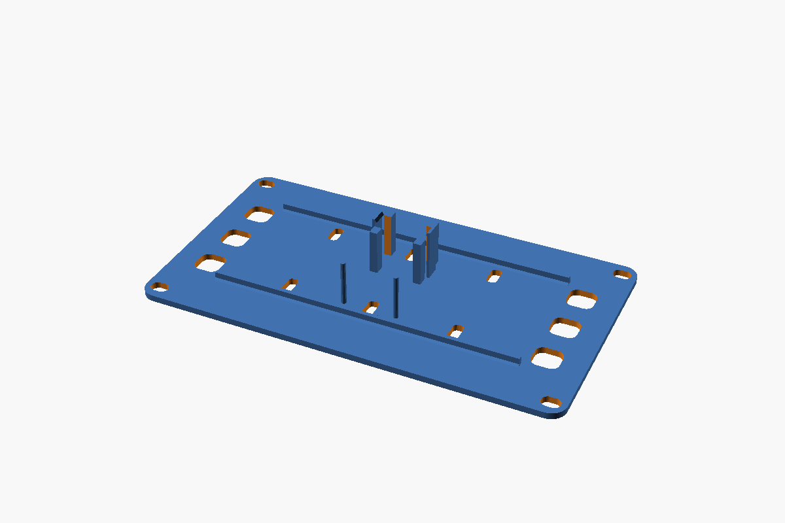 | [`canary_hammond_chassis.scad`](./canary_hammond_chassis.scad) |
| **Mount adapters** — the T-stud interface everywhere: 90° corner wedge, magnet plate, pole strap plate, drill template | set `stud_gap` per case | 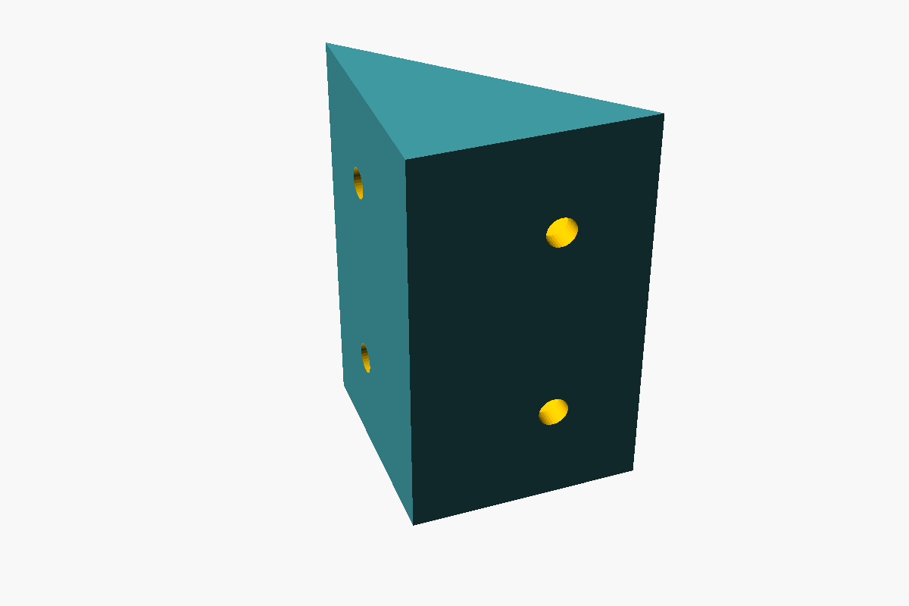 | [`canary_mount_adapters.scad`](./canary_mount_adapters.scad) |
| **Functional inserts** — buzzer horn (louder chirp), matte anti-glare ring, 3-part printed cable gland (TPU bush) | glue-in / press-in parts | 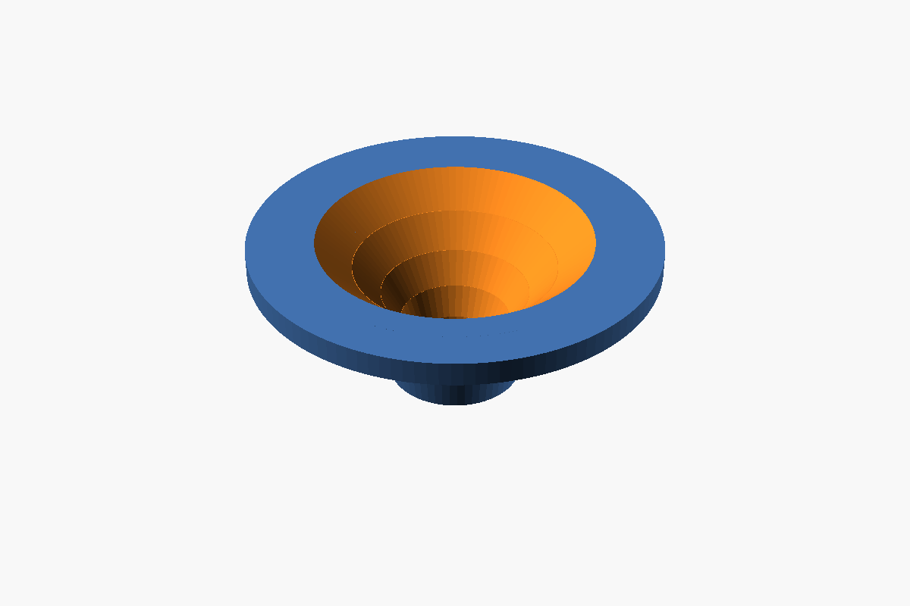 | [`canary_inserts.scad`](./canary_inserts.scad) |
| **Covert junction box** — compact WAP disguised as utility hardware; aperture hidden in a mock knockout | pair with the signage plate | 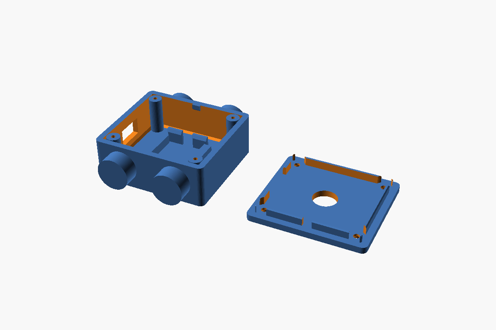 | [`canary_jbox.scad`](./canary_jbox.scad) |
| **Witness signage plate** — "presence sensing in use / no video stored", debossed, 3 parametric lines | check local signage rules | 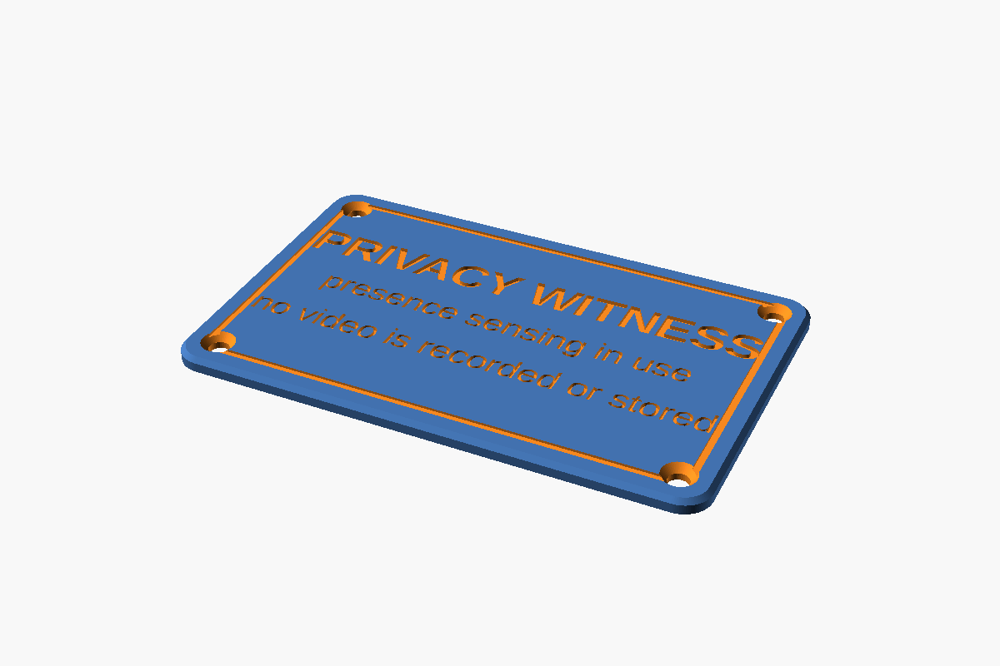 | [`canary_sign.scad`](./canary_sign.scad) |
| **Field case** — bag-carry rugged witness at the honest top of the FDM ceiling: Ø1.5 O-ring cord (27 % squeeze), six-lobe clamp, zero external ports (open to charge), bonded PC lens disc behind a contrast-color trim bezel, ePTFE vent, 4 mm walls, TPU impact boot + lanyard. CER‑4 intent: IP67 + MIL‑STD‑810H transit drop — [earn the rating, don't assume it](./field_ratings.md) | 72 × 39 × 21 body; boot on ≈ 94 wide | 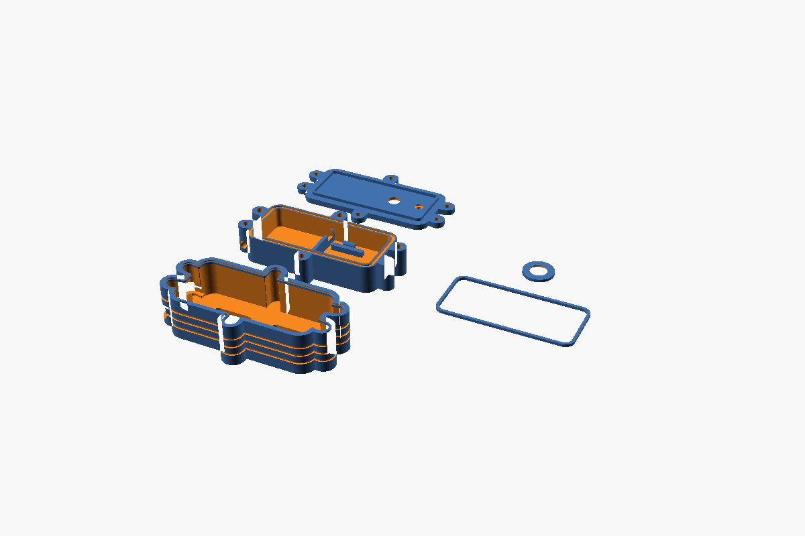 | [`canary_field_case.scad`](./canary_field_case.scad) |
| **Dashboard display case** — Waveshare ESP32-S3-Touch-LCD-4.3 (the [display research](../display_research.md) step-up dashboard): face-down bezel frame, vented screw-on back that **clicks onto a wall cradle** ([`canary_cradle_lib.scad`](./canary_cradle_lib.scad) — two rigid T-studs carry it, two sprung clips hold the bottom, pull it off for service), free-standing 25° desk cradle. v0.2 retires the old back pattern: a 75 mm M4 pair on one centerline crossed with two keyholes on the other made an X of four holes and two fastener systems, which the dock replaces with one plate and two screws. Panel dims are NOMINAL — measure yours | glass drops in, bezel lip 2.5 | 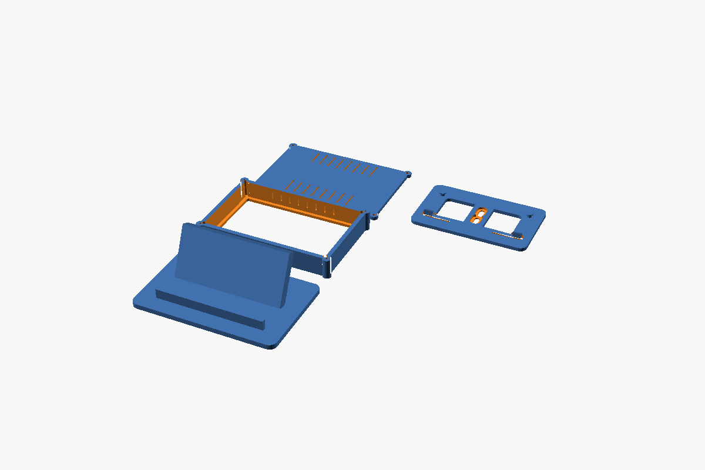 | [`canary_dash_display.scad`](./canary_dash_display.scad) |
| **S3 hallway stick case** — Waveshare **ESP32-S3-LCD-1.47** (the USB-A STICK, not the C6 header board). The hallway nightlight body: plugs into a wall adapter, the 172x320 glass faces the corridor, and the WS2812 leaves through a **lit white seam** down both long walls. Screwless — four cantilever beams cut into the bezel wall, sized by strain (ε printed at render, PETG budget 1.8%), with ASYMMETRIC return angles: steep at the plug end so it never lets go, shallow at the far end so a thumb pops it for the microSD. The plug end is the whole design problem: the opening is a RECTANGLE (series-A is not a stadium — that is USB-C), the wall is thin and relieved so a recessed receptacle clears it, an assert fails the render if under 11 mm of insertion length survives, and the drop buttress reaches INWARD (outward would eat the very length it protects). The RGB does **not** fire backwards — Waveshare's "clear acrylic sandwich panel" is the tell, the LED glows out the edge gap between the LCD module and the PCB — so the light gets a **seam** along the side walls at exactly that band rather than a hole in the back, which frees the back for the mark. The seam is filled with **unfilled white PETG**, a light pipe rather than a slot, and its x span is derived from the cavity face and asserted: the first version stopped 0.65 mm short and would have shipped a light pipe with no light in it. The side elevation reads 1 mm black / 3 mm white / black. Ties are hidden ribs in the inner 1.2 mm of the wall, so the white line is unbroken and each side presses in as ONE strip. No vents — the case is 8.2 mm of measured stack in a 9.2 mm shell, and the thumb scoop to the USB opening is the airway. Black PETG, yellow mark, white band. **Two board builds** since the board is sold bare but advertises GPIO expansion: `headers="none"` and `headers="male"` (the 2.54 mm rows soldered pointing down). The plug end does not move — headers add depth *behind* the PCB, so the insertion length and the drop collar are untouched and the case simply gets 5.85 mm deeper (bezel 9.200 → 15.050). What the axis does turn on is the compliant PCB ribs: they land on the same long edges the pin rows run down, and at the unmeasured `hdr_inset` candidates they clear by 0.20 mm or overlap by 0.20, so that arithmetic is an assert rather than a comment | screwless snap, thumb-release, 3 filaments, 2 board builds, `gen_3mf.py stick` / `stick-male` | 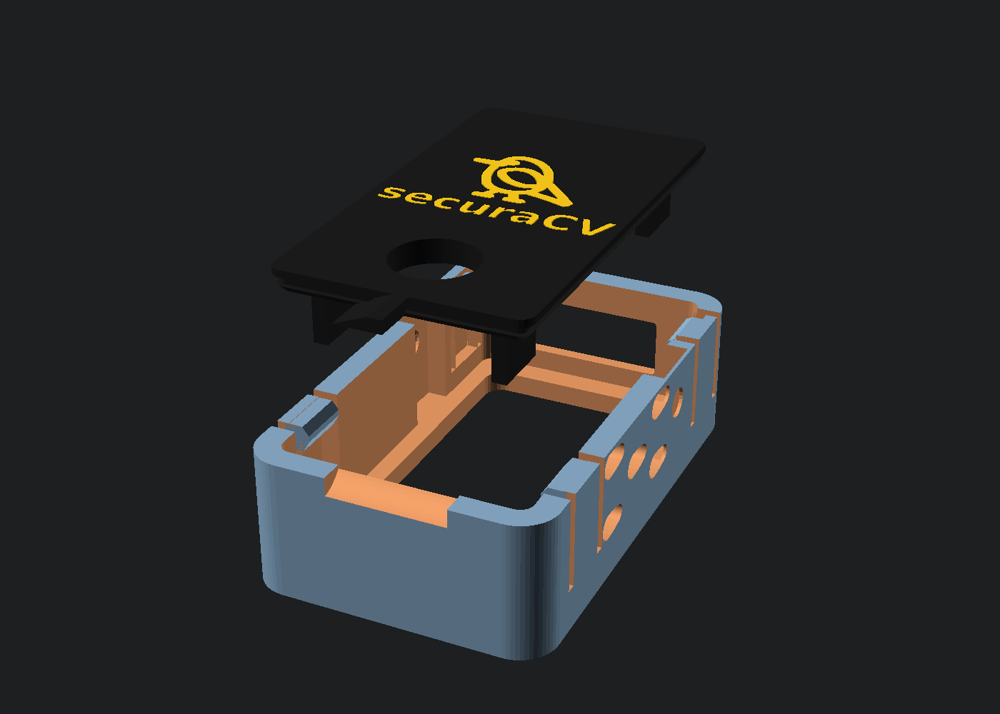 | [`canary_s3_lcd147.scad`](./canary_s3_lcd147.scad) |
| **C6 display pocket case** — Waveshare **ESP32-C6-LCD-1.47** (portrait), both board builds: `headers="none"` (stripped: no headers, corner pillars removed) or `headers="male"` (as shipped: down-facing pin headers + brass M2 corner pillars — deeper cavity, press bosses land on the pillar tops). Face-down bezel over the active-area window, edge-captured board (no screws into the board), snap-in vented back, blind keyhole. The overhanging BOOT/RST buttons and the USB-C shell (both BACK-mounted — photo-verified) get full-depth insertion channels behind "ear"/"chin" wall bulges, and the USB-C port is a true stadium (full-round ends) sized shell + tolerance. `model="1.47"` is drawn from the Waveshare mechanical drawing; a `"1.69"` preset is parameterised. The bezel face prints **flat on the plate** — the same untapered "edge chamfer" the C3 sibling carried, drawing the same 0.80 mm square rabbet around the first-layer perimeter, is gone here too (390.33 mm² of bed contact where flat gives 493.69), and [`check_foot_relief.py`](./check_foot_relief.py) is what keeps it gone. Heat-escape slots on the sides + a back grille | snap-fit, vented, 2 board builds | 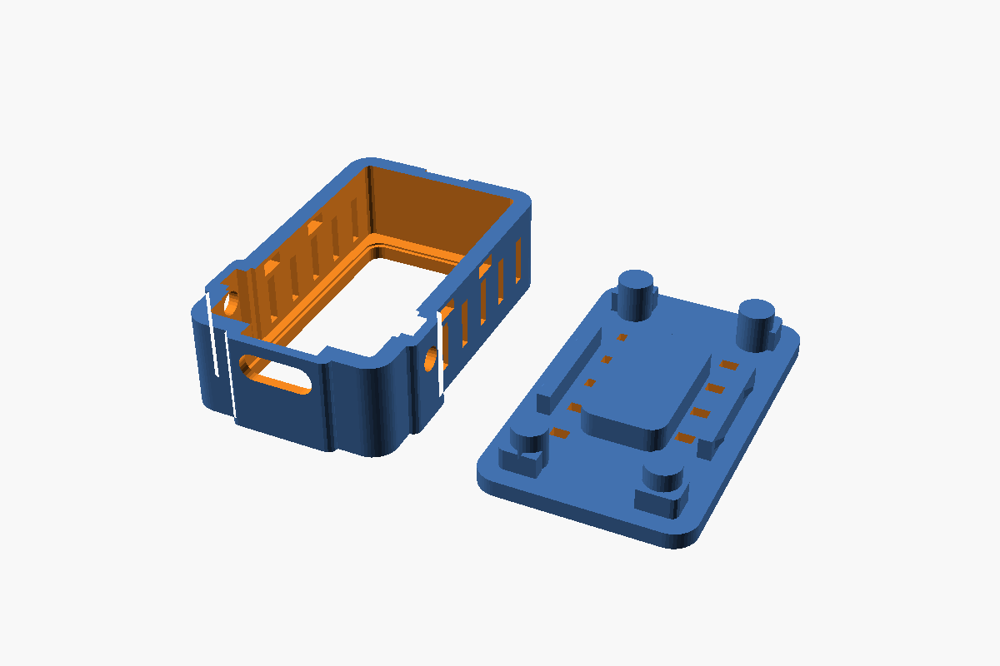 | [`canary_c6_display.scad`](./canary_c6_display.scad) |
| **C3 pocket display case** — Waveshare **ESP32-C3-LCD-1.47** (portrait; the C6 sibling's exact outline + panel, plus a TF slot and an RGB LED), three board builds: `headers="pillars"` (the board **as Waveshare ships it** — brass corner pillars on, headers not soldered; the press bosses span the measured 2.8 mm to land on the flat pillar tops and hold the board against the bezel, and the lid skirt is notched around each pillar), `"none"` (stripped, pillars unscrewed — the shallowest case), or `"male"` (down-facing headers + pillars — deepest, thin skirt clear of the pin rows). Three PETG spools, and the **slots are roles**: slot 1 body = **YELLOW** (bezel and lid both), slot 2 mark = **BLACK**, slot 3 light = **WHITE**. The white does the job of Waveshare's clear-acrylic sandwich: measured off the hardware at 1 mm behind the glass front, 2.8 mm tall, and it is **ONE continuous U** — up both long walls, around both far corners, across the LED's end wall — white through the full wall depth with no ties crossing it. Both earlier cuts are lessons kept: outer-skin webs chop the strip into dashes, inboard ribs put black slats in the light path, and a strip that stops short of the corners goes dark exactly where it turns. The black is the **branding**: the lid's back carries the "Canary" wordmark, debossed and filled at zero clearance so the AMS fuses it. The wordmark alone, not the bird — [`canary_mark_lib.scad`](./canary_mark_lib.scad) states a ~30 mm minimum for the mark's interior detail and this lid is 25.12 mm across. It carries the mark **and** the wall hanger (`lid_back`): the plate is 41 mm tall and the wordmark takes four of them, so the hanger sits high and the word reads below it. The hanger is an **egg** — [`canary_vent_lib.scad`](./canary_vent_lib.scad)'s house ovoid, mounted upright (wide base down, crown up). A round keyhole admits exactly one head size and a real wall screw did not fit the old Ø7 one; an egg tapers continuously, so one opening takes a range of heads — offer the head into the base, let the case drop, and the flank carries the screw to the crown, which is sized to the shank and will not give the head back. The through cut is asserted clear of the press bosses and the skirt's snap band. The glass is **located, not clamped**: bosses cut to the exact component stack (no preload), and the face touches the panel only on a land over the module border — the innermost 0.5 mm of lip is relieved 0.25 so the window rim never puts a contact line on the glass edge. BOOT/RST are **printed-in-place flexure paddles**: a press pad cut free by a 0.55 mm slot on three sides, hinged at its USB end, a boss on its back over the actuator — press it with a fingertip, no tool, nothing internal exposed, and the pad sits recessed so a pocket squeeze lands on the ear rim instead. USB-C is a true stadium hugging the shell at ~0.05 mm per side with a **chamfered** rim for the plug's overmold (the recessed ring it replaced left a 0.4 mm floor over the insertion slot and broke out on the first print). The front face itself prints **flat on the plate**, with no modeled foot relief: the "face edge chamfer" this file used to carry was an untapered cut, so what it drew was a 0.80 mm square **rabbet** around the whole first-layer perimeter — an overhang, on the one surface a person looks at, giving up a fifth of the face plate's bed contact (403.62 mm² where flat gives 508.15) to duplicate a ~0.2 mm elephant-foot compensation the slicer already applies. [`check_foot_relief.py`](./check_foot_relief.py) measures every exported mesh and fails the build if a stepped foot comes back; a real taper still passes. **Keyed lid**: the board's M2 pillar pattern is asymmetric, so offered the wrong way round the skirt lands on the USB shell and refuses to close — the error is physical, not a rattle you discover later. Asymmetric snap nubs give it a real click. microSD swaps with the lid off (the slot mouth faces down-board; no wall window could pass a card). **Two plates, not one with a flag**: `gen_3mf.py c3` cuts the case for the board as Waveshare ships it, `gen_3mf.py c3-male` cuts it for a board with the headers soldered on — 3.00 mm deeper in the bezel (12.25 → 15.25) with press bosses 3.00 mm longer (4.80 → 7.80) and a thin skirt clear of the pin rows, same outline. They are not interchangeable on a finished print, so the board they were cut for is in the filename; `-bezel` / `-lid` suffixes split either one when you are iterating on one half. **It also fits the USB-A board** (`port="usb_a"` — the ESP32-S3-LCD-1.47, same PCB outline, same panel, same buttons, but the board *ends* in a series-A male plug): `gen_3mf.py c3-usba` / `c3-usba-male`. The port axis is the only difference and it is additive — every USB-C part renders vertex-for-vertex identical to before it existed. Four things move with it: the opening becomes a **rectangle** (a stadium leaves a series-A shell's square corners nowhere to go), it centers on the **PCB mid-plane** because the plug straddles the board rather than sitting on its back, the chin bulge disappears (nothing to swallow — the plug goes through and stands outside), and the root gains an **inward** drop collar (outward would spend the very insertion length it protects; the assert caught that on the first cut, at 8.8 mm against an 11.0 floor). The interesting one is the **light ring**: a series-A plug sits low enough to land on the band, so rather than shortening the ring on every wall or stopping it at this one — the U this case abandoned when print 3 showed the pipe going dark where it turns — the ring **dives under the plug**, keeping 1.55 mm of white running beneath the opening. Still one closed ring, and the band's part count is what proves it. Not offered in the `pillars` build: that is a measured claim about the C3's brass standoffs and nobody has had an S3 in hand to say the same | 3 filaments, snap lid, keyed, 2 boards × 3 board builds, `gen_3mf.py c3` / `c3-male` / `c3-usba` / `c3-usba-male` | 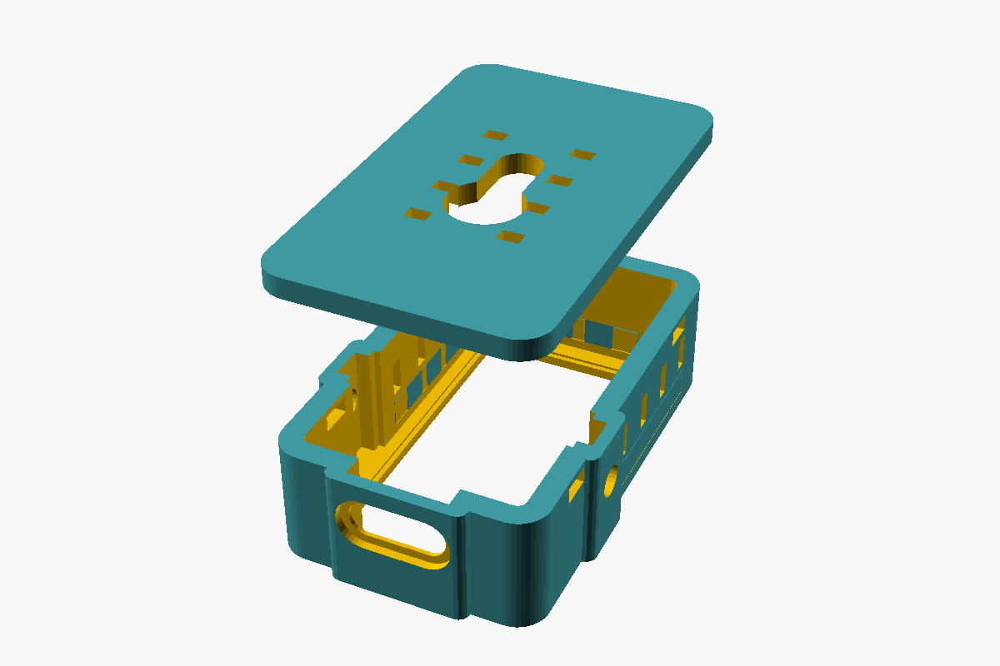 | [`canary_c3_lcd147.scad`](./canary_c3_lcd147.scad) |
| **7″ touch dashboard case** — Waveshare **ESP32-S3-Touch-LCD-7** (7″ 800×480 capacitive touch): the wall/desk slab. Face-down bezel retains the bonded glass over the active-area window; deep vented rear tray carries the PCB on molded M3 standoffs and screws to four **gusseted** outboard M3 corner ears (webbed into the shell — no thin necks). Real convection path (**bottom-wall intake → top-wall exhaust** — print in PETG/ASA, this panel runs hot; the two-part tray adds a ~41 cm² back grille, and the one-piece `frame`'s plate deliberately carries none — see the back-plate section), bottom connector channel + side USB/CAN/RS485/battery slots on the tray. The one-piece `frame` adds a bottom-centered **USB pass-through** plus a matching **side exit** on the microSD's wall (hang the case portrait with that wall down and the cable leaves out the bottom; the leashed blank fills whichever exit is idle) and three **TPU fitments**: a slit wire grommet (strain relief — tugs load the frame, not the board), a captive leashed press-through BOOT/RESET plug whose press towers reach the button caps at the board edge, and a peel-open SD cover that stays attached. Optional 20° desk **dock** for the frame (drop-in slot on tilted seat pads, self-centering keys into the frame's keying slots, landscape **and** portrait — portrait seats on well ribs — open well under the USB port + desk-level cable channel for the power lead, vented back fin, tip-checked both ways — `stand_gauge` proves the slot before the big print). **Print the `gauge` corner pair first** (~16.5 g vs ~158 g) — see the [P2S bring-up](./bambu_p2s_bringup.md#7--print-3--the-7-dashboard). Connector centers and `pcb_h` are NOMINAL — measure yours | glass drops in, lip 10.4, TPU-fitted ports | 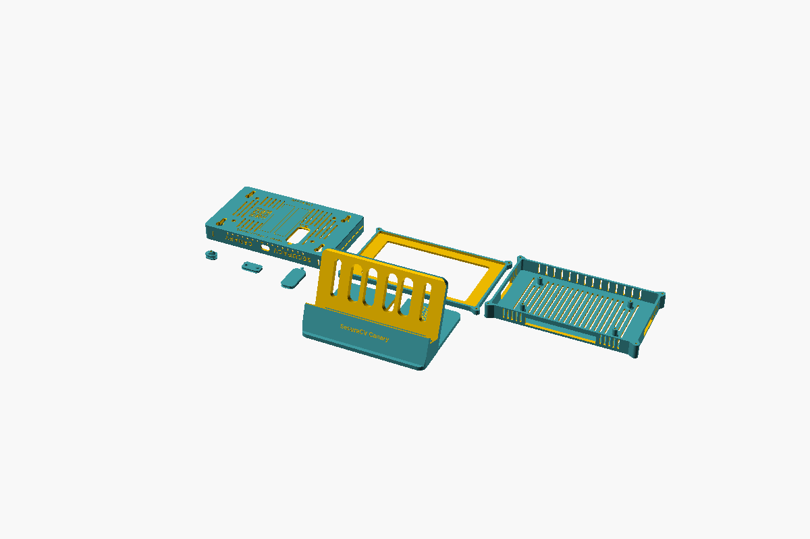 | [`canary_s3_lcd7.scad`](./canary_s3_lcd7.scad) |
| **1.69″ touch watch-display puck** — Waveshare **ESP32-S3-Touch-LCD-1.69** (rounded-square 240×280 capacitive-touch smartwatch board — S3, IMU, RTC, battery/charger). The bonded glass slab (41.13 × 33.13) overhangs the smaller PCB (37.12 × 29.83) by ~2 mm, so the face lip captures it — no screws (this board has no mount holes). Face-down bezel + snap-in vented back (skirt rides the overhang, 4 nubs, standoffs press the board forward, blind keyhole). USB-C (bottom) + PWR/BOOT/RST (top) + battery/RTC/pin slot (side); side heat slots + back grille; optional 22° cradle. Connector centers NOMINAL — measure yours | snap-fit, vented, edge-captured | 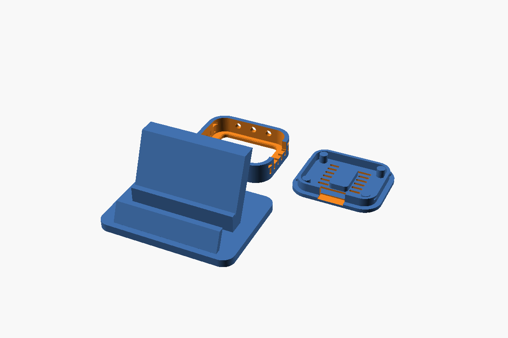 | [`canary_s3_touch169.scad`](./canary_s3_touch169.scad) |
| **Vehicle mount kit** — VHB-taped dash plate with a 10° stud riser + an air-vent louver clip (extruded spring prongs snap over one blade). ⚠️ cabins exceed +60 °C: USB power only, ASA, light colors | set `stud_gap` per case (36 = field) | 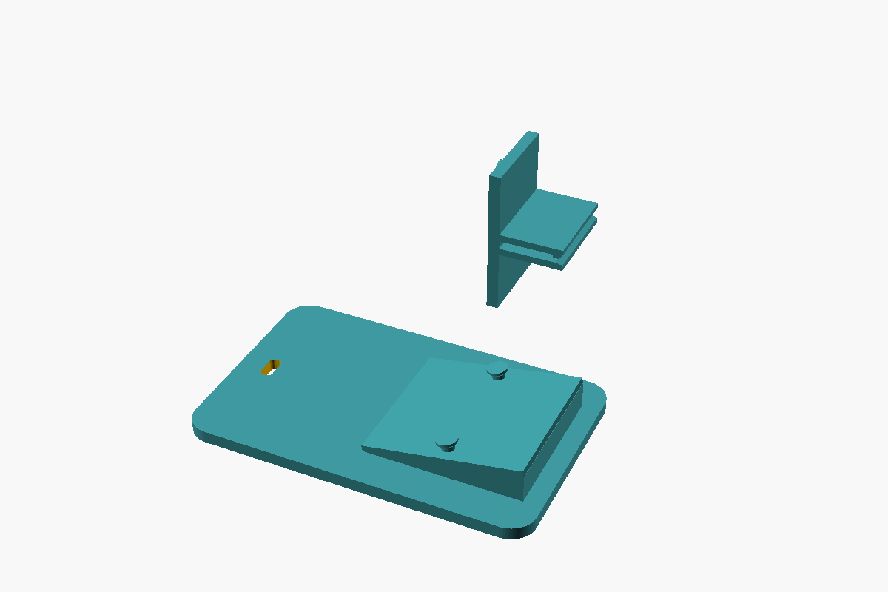 | [`canary_vehicle_mount.scad`](./canary_vehicle_mount.scad) |
| **Body-worn clips** — belt leaf-spring clip (prints on its side: flex stays in-plane) + MOLLE/PALS weave plate, both on the two-stud interface; made for the field case's floor keyholes | check local recording law; pair with the sign | 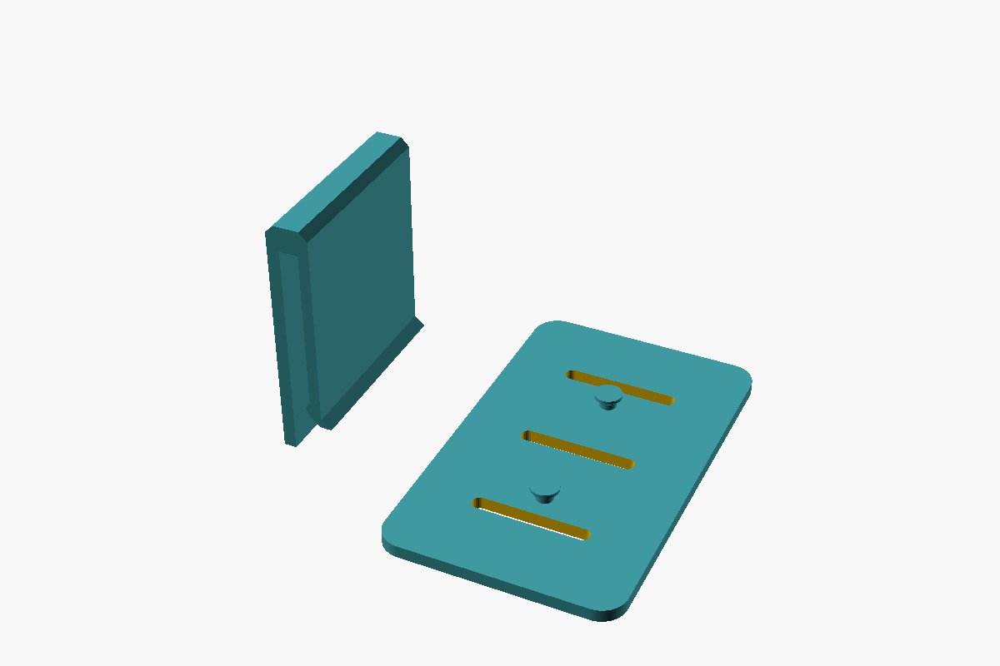 | [`canary_wear_clip.scad`](./canary_wear_clip.scad) |
| **Vision Pro mount** — bridges a Seeed reCamera Pro onto the shared stud interface: keyhole pockets on the back (hangs on any existing stud surface in this catalog), 1/4"-20 tripod counterbore and/or magnet pocket on the front (reCamera's confirmed mount options, [Canary Vision Pro doc](../canary_vision_pro_recamera.md)). No confirmed body dimensions yet — mounting interface only | measure your screw/nut; no bench unit yet | 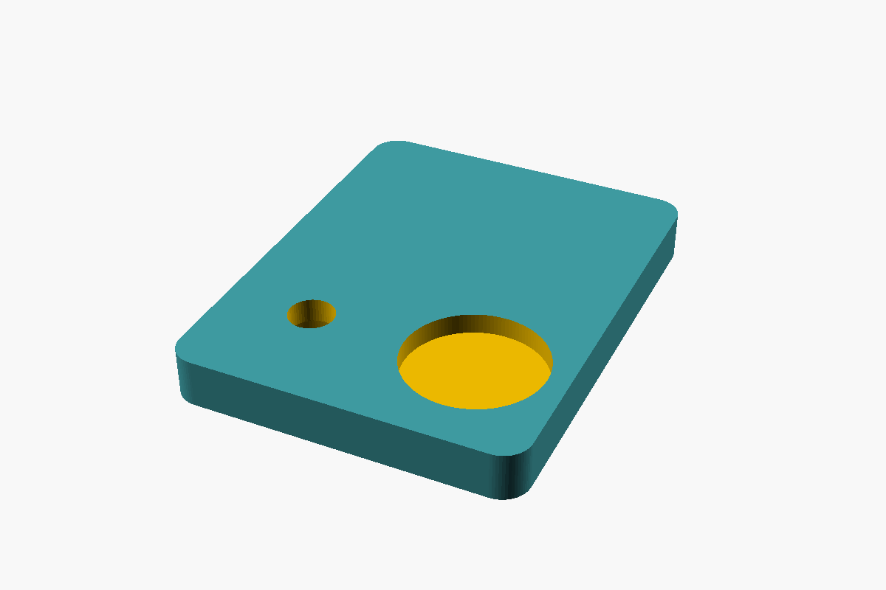 | [`canary_vision_pro_mount.scad`](./canary_vision_pro_mount.scad) |
| **Universal fit coupon** — ONE small print that calibrates every fit in the catalog: the **Canary mark embossed in uniform domed strokes** (no feature narrower than one rib, so that single width decides the whole emblem), the WAP's two-sided clip channel, keyhole+stud **with a click detent** (slide the mate on, it clicks and stays — the doorbell-plate retention test), slide tongue, gasket, press, screw (+ a −/0/+ pilot ladder), insert, the USB-C port opening, and the embossed/debossed brand wordmarks — each station labeled with the parameter it tunes | **print this before any case** | 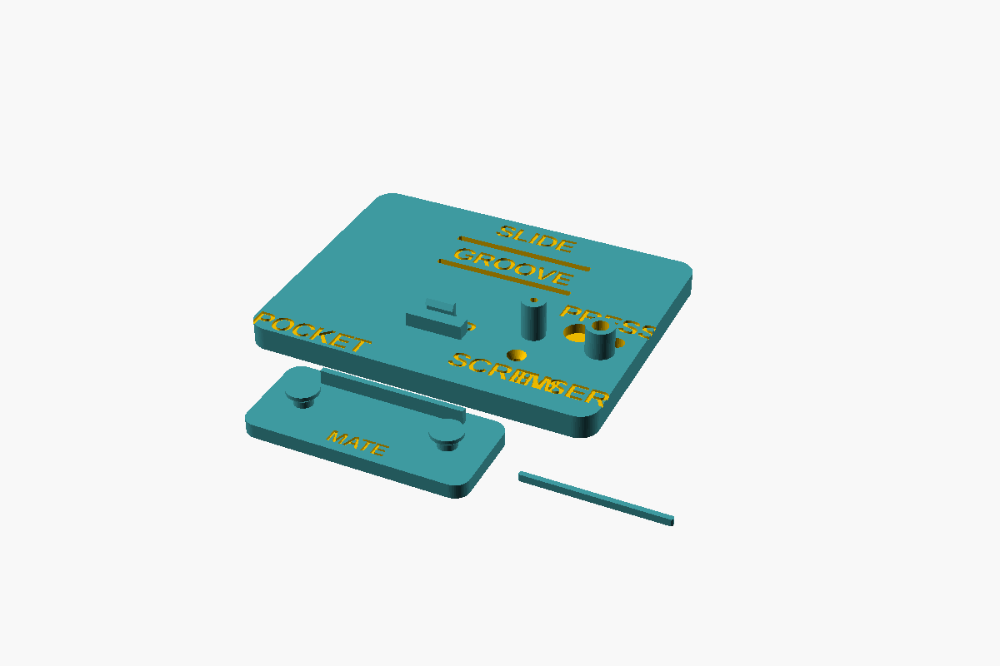 | [`canary_fit_coupon.scad`](./canary_fit_coupon.scad) |
| **Bench bring-up fixture** — labeled stations for XIAO + BZ1/DLED1/SW1/SW2 with a sliding magnet carriage for repeatable tamper tests (companion to [bench_bringup.md](../bench_bringup.md)) | wire channels per §5 pin map | 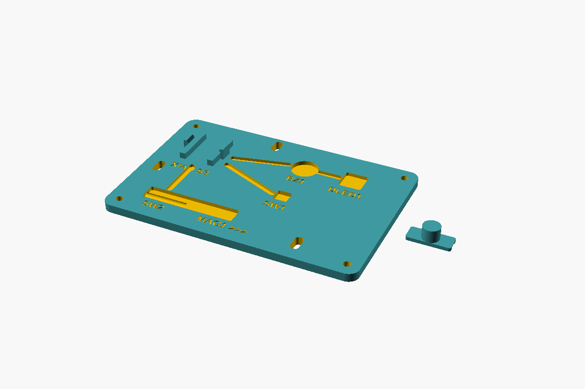 | [`canary_bench_fixture.scad`](./canary_bench_fixture.scad) |
| **Fleet provisioning dock** — N numbered reclined bays for bare XIAOs beside a USB hub (v1 runbook fleet flashing) | `n_bays` parametric | 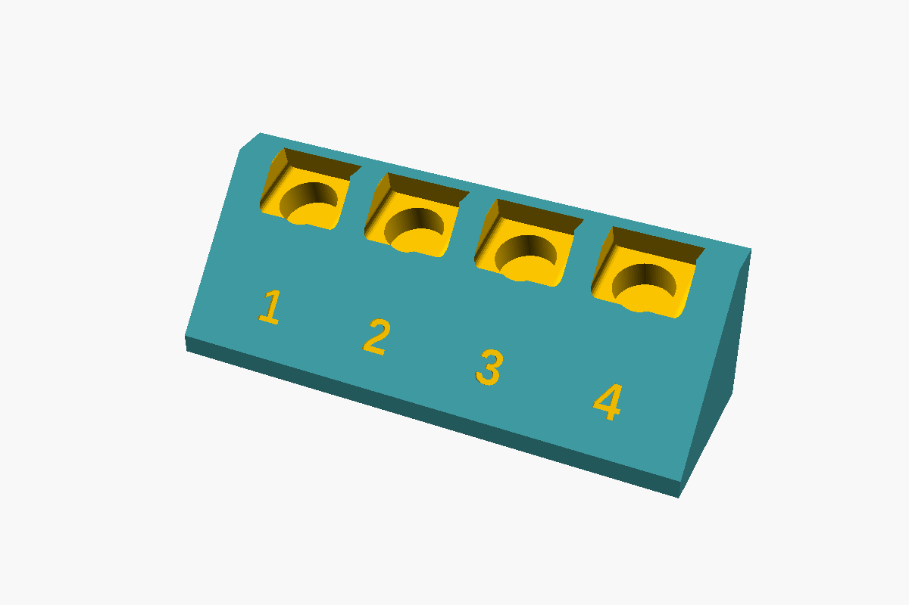 | [`canary_dock.scad`](./canary_dock.scad) |
| **Shop tools** — heat-set insert press guide (keeps inserts square) + doorbell button accent ring | tiny prints | — | [`canary_shop_tools.scad`](./canary_shop_tools.scad) |
| **Paper install templates** — 1:1 SVGs ([studs](./template_studs.svg) · [bracket](./template_bracket.svg) · [doorbell](./template_doorbell.svg)): print ON PAPER at 100 % (verify the 20 mm square), tape to the wall, drill | no plastic needed | — | [`canary_templates_2d.scad`](./canary_templates_2d.scad) |

## Engineering & materials (security build)

These are housings for a *security* device — the enclosure is the first
physical attack surface — so the designs follow FDM packaging-engineering
practice for **durability, rigidity and low mass**. (For what these cases
can honestly claim against IP / MIL‑STD ratings — and the home test
protocols that earn each level — see
[**field_ratings.md**](./field_ratings.md).)

- **Stiffness from geometry, not bulk.** Plate stiffness scales with t³: the
  lids/fronts carry a perimeter **rib ring** (`lid_ribs`, on by default) just
  inside the lip, auto-routed around every feature — roughly trebling the flat
  face's bending stiffness against prying for ~1 g of material. Walls stay at
  2.0 mm (= 5 extrusion widths), with the corner posts gusseted into both walls.
- **Layup-aware loading.** FDM interlayer (Z) strength is only ~50–70 % of
  in-plane. Both shells print so the service loads — lid pry, wall impact,
  screw clamp — act *in-plane*; the bottom edge (the classic delamination
  initiation site) gets a 45° **`foot_cham`** chamfer that also removes
  elephant-foot.
- **Service-grade fastening.** The M2 self-tappers are fine for ~10 open/close
  cycles at ≤0.3 N·m. For a serviced fleet, set **`screw_insert = true`**: the
  corner posts auto-fatten (≥1.2 mm wall around the bore) for **M2 brass
  heat-set inserts** (3.5 × 4.0 short series; install at 220–240 °C for PETG,
  240–260 °C for ASA, flush to the post top) and use M2 machine screws.
  Plastic creeps under gasket preload — **re-torque sealed builds after 24 h**,
  or fit inserts and be done with it.
- **Anti-lift security.** Keyhole mounts can be defeated by lifting the unit
  off the wall screws. `kh_lock` (default on with keyholes) adds two blind
  **knockout bosses** (0.6 mm web — the seal stays intact until used): after
  hanging, drive #4/M3 screws through them into the wall from *inside* the
  case, so removal requires opening the lid first. Pair with the tamper
  magnet/reed option and, if you want tool-only access, security-drive (Torx
  pin) M2 screws. On the Vision hinge, swap the thumbscrew for an **M5 button
  head + nyloc** to make the angle tool-only and vibration-proof.

**Material selection** (the housings are unfilled-polymer friendly; the Vision
*bracket and prongs* are the highest-stressed parts):

| Material | Use for | Why / limits |
|----------|---------|--------------|
| **PETG** | default, indoor + sheltered outdoor | tough, easy, low moisture pickup; creeps under sustained clamp — use inserts for sealed builds |
| **ASA** | outdoor, sun-exposed | UV-stable, HDT ~95 °C; print hot and draft-free |
| **PC / PC-blend** | maximum impact + heat (vandal-prone spots) | highest toughness/HDT; needs an enclosed printer; pair with neutral-cure silicone only |
| **CF-PETG / CF-Nylon** | Vision **bracket + knob** | ~2× stiffness for the cantilevered hinge; hardened nozzle required |
| **TPU 90–95 A** | gaskets | 2 perimeters, 100 % infill, slow |
| PLA | clip coupon / fit checks **only** | creeps and softens ~55 °C — not for deployed housings |

**Thermal / outdoor kit** — the enemy outdoors is solar heat as much as
water: a dark case in sun can exceed the LiPo's comfort zone (build plan
§9.2). `part="shield"` prints a Stevenson-screen style **solar radiation
shield**: a second roof standing 6 mm above the lid on hollow standoffs,
fastened by the existing corner screws (swap in M2 × 16–18), with apertures
auto-opened over the camera/LED/touch. Print it in **white or light ASA**.
`part="tray"` is a slotted **desiccant tray** for a 1 g silica pack — clip or
VHB it into any Canary cavity to keep condensation off the boards. For insect
resistance, keep vent holes ≤ 1.0 mm (the Sense case defaults to 1.0 × 10;
on the others set `vent_hole_d = 1.0; vent_holes = 10`) or stick fine mesh
behind the GORE seat.

**Finish & printability details** (built into the models): curve quality is
driven by `$fa/$fs`, so large radii (the doorbell pill, the hood) come out
smooth instead of visibly faceted; horizontal hinge bores are **teardropped**
so their crowns print without sag; visible faces carry a **two-stage soft
edge** (`lid_edge` + `lid_edge2`, both defaulting to the house numbers in
`canary_core_lib`) that approximates a roundover while still printing
face-down without support. The second stage is what makes the edge read as a
roundover rather than a plain bevel, and it is on by default on every case —
it used to be off on five of its six adopters, which is why the family cue
reached one released show face out of eight.
For the nicest faces, print them on a **textured PEI plate** (the visible
surface is the first layer) and set the slicer's **seam position to the rear
edge** of each part.

**Consumer-grade looks — the finish ladder.** Store-bought cases read
"product" because of four things you can reproduce, in increasing effort:

1. **Free (slicer only)** — A-surfaces face-down on textured PEI (every lid
   and face here is modeled for it); **fuzzy skin ~0.3 mm on outside walls
   only** (hides layer lines completely and matches the PEI texture); seam
   painted to a rear corner; matte filament (matte ASA/PETG reads
   injection-molded in a way silk/gloss never does).
2. **Two-tone (~zero effort)** — the parts are already split along color
   lines: shell in one color, **TPU boot / gaskets / bezel + button accent
   rings in a contrast color** (graphite + safety-orange boot is the classic
   field look; all-black with a graphite bezel is the Wyze/Ring look). The
   field case's **lens trim ring** (`part="bezel"`) exists exactly for this —
   it also hides the disc's silicone bond line, which is why real cameras
   have trim rings.
3. **Paint-filled deboss (10 min)** — every `label_text` deboss is 0.5 mm
   deep: brush acrylic into the recess, let it set, wipe the face with
   isopropyl — crisp printed-on branding.
4. **Full finish (hours)** — sand 240→400, filler-primer, 600 wet, matte 2K
   clear (or ASA acetone **vapor smooth** for gloss + extra water sealing —
   outdoor-safe, but mask the gasket grooves and re-check clip fits after).

Rule of thumb: fuzzy skin + textured first layer + two-tone + paint-filled
label gets ~90 % of the consumer look for ~0 % extra work.

**Security-build slicing spec:** 0.4 mm nozzle, 0.2 mm layers, **4 perimeters**,
5 top/bottom layers, **30 % gyroid** infill, ~30 % infill/perimeter overlap,
+5–10 °C over the material's default for interlayer adhesion, minimal cooling
on ASA/PC. Anneal PETG/PC parts (65 °C / 90 °C, 1 h, supported flat) for a
further ~20 % creep and stiffness margin if you have an oven. For the full
reasoning — every Cura setting with its *why*, a per-model orientation
cheat-sheet, PETG stringing/sealing notes, and a one-click importable profile —
see [**Printing in PETG — Cura guide**](./printing_petg_cura.md) (with a
one-click [importable Cura profile](./profiles/README.md)). For the reasoning
behind it all — where strength comes from, fits, finish, durability — see
[**Best-practice printing tips**](./printing_best_practices.md).

**Mass budget** (solid-volume upper bounds from the rendered STLs; PETG at
1.27 g/cm³ — multiply by 0.84 for ASA): WAP compact ≈ 12 g/pair, WAP battery
≈ 34 g/pair, WAP weather ≈ 57 g/pair + 0.6 g gasket; Vision xiao ≈ 31 g/pair
(weather ≈ 51 g), Vision devkit ≈ 42 g/pair, bracket ≈ 10 g, knob ≈ 3 g.
Even the heaviest full kit stays under ~75 g — wall anchors, not weight,
size the mounting.

---

# Canary WAP — Enclosure (v0.8)

Parametric, printable case for the Canary WAP (XIAO ESP32-S3 Sense), documented
in §6.6 of the [Peripheral Build Plan](../canary_peripheral_build_plan.md).
Authored in [OpenSCAD](https://openscad.org), and built as a **configurator**:
tick the peripherals you fitted and the case rebuilds itself — adding the right
bays, ports and cutouts and resizing to suit. Opt-in extras add a **TPU gasket +
drip-edge lid** for splash resistance and **wall-mount keyholes/tabs**.

## Configure it (you tick what you have)

Open `canary_wap_enclosure.scad` in the **OpenSCAD GUI** → the **Customizer**
panel shows your options as checkboxes. Tick what's on your device:

| Checkbox | When ticked, the case adds… |
|----------|------------------------------|
| `opt_camera` | sensor **window** on the lid (+ recessed seat for a clear disc) + extra internal height (Sense camera). Off ⇒ shorter cavity for a plain XIAO |
| `opt_buzzer` | **vent** (hole-ring + GORE seat) on the lid |
| `opt_led` | **light-pipe** port on the lid |
| `opt_battery` | **LiPo bay** beside the board (enlarges the case) |
| `opt_gps` | internal **GPS module bay** (L76K) |
| `opt_tamper` | **magnet pocket** on the lid underside |
| `opt_touch` | thinned **touch window** on the lid (capacitive sensing through the wall) |
| `opt_antenna` | **bulkhead hole** in the side wall for a u.FL/SMA antenna |
| `opt_seal` | **weather mode**: perimeter gasket groove + printable TPU gasket + drip-edge lid + USB plug recess (see [Weather mode](#weather-mode-opt_seal)) |
| `opt_mount` | **wall mounting**: blind keyholes and/or external screw tabs (see [Mounting](#mounting-opt_mount)) |

Prefer a one-click starting point? Set **`preset`** to `battery_full`,
`compact_plain` or `battery_weather` (overrides the checkboxes), or leave it
`custom` to use them. Then set `part` to `base`, `lid`, `all`, `coupon`, or
`gasket` and export.

The three committed example presets:

| Preset | Outer size (rendered) | What's on it |
|--------|----------------------|--------------|
| **battery_full** | **104.5 × 39 × 17.9 mm** | camera + buzzer + LED + LiPo bay + GPS bay + tamper |
| **compact_plain** | **33.7 × 36.6 × 15.05 mm** | plain board (no camera), buzzer + LED, USB-powered |
| **battery_weather** | **106.9 × 41.4 × 21.25 mm** | battery_full **+ gasket seal + drip-edge lid + keyhole mounts + weep** |

> Corner posts always sit in **true corners beside the board** — that's why even
> the compact case isn't as tiny as the bare-board reference. The board is always
> parked against the **USB (−X) wall** so the connector reaches the opening.


| | |
|---|---|
| **Source** | [`canary_wap_enclosure.scad`](./canary_wap_enclosure.scad) (configurator) |
| **Example STLs** | [`..._battery_base/lid.stl`](./canary_wap_enclosure_battery_base.stl), [`..._compact_base/lid.stl`](./canary_wap_enclosure_compact_base.stl), [`..._weather_base/lid/gasket.stl`](./canary_wap_enclosure_weather_base.stl) |
| **Clip test coupon** | [`..._clip_coupon.stl`](./canary_wap_enclosure_clip_coupon.stl) — print first to tune the snap fit |
| **Fasteners** | 4 × **M2** flat-head self-tapping screws into the corner posts — max length is echoed at render (10 mm compact, 13 mm battery: the pilot is blind). `screw_size` = `m2` / `m2.5` / `m3` and `screw_head` = `flat` / `pan` re-derive pilot, clearance, seat and post size from the catalog's screw registry (`canary_core_lib`) |

## Print tolerances (tune once for your printer)

All fits are driven by three per-side clearance parameters, applied uniformly.
Print the **clip coupon** and check the lid fit on a small test before adjusting:

| Param | Default | Governs | Symptom → change |
|-------|--------:|---------|------------------|
| `tol_slide` | 0.20 | lid lip ↔ base, drip skirt ↔ wall, camera-disc seat | lid binds → raise; lid rattles → lower |
| `tol_press` | 0.10 | tamper magnet pocket, LED light pipe | part won't press in → raise; falls out → lower |
| `tol_hole` | 0.30 | lid screw clearance holes | screw drags on the lid → raise |
| `clip_clear` | 0.25 | snap-clip face ↔ board edge | tune **on the coupon**, with `clip_t`/`clip_hook` |

Enter **true part sizes** in the dimension parameters (e.g. `mag_d` is the
*magnet* diameter, `lp_d` the *light-pipe* diameter) — the tolerance system adds
the clearance for you.

> **Migrating from ≤ v0.6:** `mag_d` used to be the *pocket* size (6.4); it is
> now the *magnet* size (6.0) and the pocket is a **press fit**
> (`mag_d + 2*tol_press`). `fit_gap` was renamed to `tol_slide`.

## Weather mode (`opt_seal`)

A printed case is **never IP-rated**; for harsh outdoor exposure use the
polycarbonate enclosures listed in build plan §9. Weather mode upgrades this case
from "indoor only" to **rain/splash-resistant (≈ IP54)** — *not* immersion:
the four corner screws can't clamp the long spans like a molded box can.

What `opt_seal = true` adds:

- **Perimeter gasket groove** in the base rim (walls auto-thicken to 4.0 mm to
  host it with a 1.2 mm cheek each side) and a matching **printable TPU gasket**
  (`part = "gasket"`). The gasket stands
  0.3 mm proud and squeezes ~20 % under the lid screws (the ring prints 0.5
  narrower than the groove — ~86 % fill — so the incompressible TPU has room
  to flow instead of propping the lid open).
- **Drip-edge lid**: the lid grows a 3 mm skirt that overlaps the base wall, so
  water sheds off the seam instead of sitting on it.
- **USB plug recess**: a shallow recess frames the USB-C opening so a flanged
  silicone dust plug seats flush (fit one for deployment; remove to charge/flash).
- **Rim headroom guarantee**: the cavity auto-grows so the gasket path stays
  continuous above the USB opening (and, in every mode, so at least
  `usb_web` = 1.5 mm of wall stands over the opening — the v0.7 compact case
  shipped a 0.65 mm bridge there).
- **Weep** (`opt_weep`, on in the weather preset): a Ø2 drain through the
  USB wall at the floor corner — the low point when hung USB-down — angled
  downward, so condensate leaves and driven rain does not enter.
- **Sealed screw heads** (`head_seal`, off by default): the corner posts stand
  INSIDE the gasket line, so a bare screw is a drip path down its thread onto
  the post and into the cavity. `head_seal = true` cuts an O-ring gland under
  each head (a standard 2 × 1 ring for M2; needs `screw_head = "pan"`) and
  the head squeezes it 25 %.
- **USB drip awning** (`usb_hood`): for a case that stands sideways or on a
  desk rather than hanging USB-down — a 45° awning over the opening that
  prints with the wall. Exclusive with the plug recess.

To finish the seal you also need to:

1. **Camera window**: glue a **12 × 1 mm clear PMMA or polycarbonate disc** into
   the recessed seat on the lid face with **neutral-cure silicone** (acid-cure
   attacks polycarbonate). Run the bead full-circle.
2. **Buzzer vent**: stick an **adhesive GORE-type membrane vent** over the
   recessed seat on the *outside* of the lid — it passes sound and equalizes
   pressure while blocking water.
3. **Light pipe**: bed the pipe in a drop of the same silicone.
4. **Antenna** (if fitted): use a gasketed bulkhead or seal the hole with silicone.
5. **Mount it USB-down** (see below) so the lid is vertical, the vent faces
   sideways and the only wall opening points at the ground.

**Gasket print settings:** TPU 90–95A, 0.2 mm layers, 2 perimeters, 100 % infill,
slow (~25 mm/s). It's a 1.1 mm-wide ring — print it alone, brim optional.

**Assembly order with the seal:** board + battery in, gasket into the groove,
lid on (lip nests inside the gasket ring), then the 4 screws in two passes
(snug diagonally, then final quarter-turns) so the squeeze is even. With
`head_seal`, drop an O-ring into each gland before the screw.

**Drop resistance:** `batt_hold` (default on) drops two ribs from the lid over
the battery bay, resting `batt_h` above the floor so the cell cannot bounce
(it sat under ~8 mm of free air) while the swelling allowance in `batt_h`
stays; the tamper pocket now sizes the cavity against the Sense expansion
board under it (`mag_under`), and the camera window is asserted against
`cam_fov` so a corner never vignettes.

## Mounting (`opt_mount`)

`mount_style` selects `"keyhole"`, `"tabs"`, or `"both"`. The case hangs with
the **USB end facing down** — that's the water-shedding orientation and the
keyhole slots are oriented for it.

- **Keyholes** (default): two **blind** keyhole pockets in the case back — they
  never break into the cavity, so weather mode stays sealed. The back thickens
  by `kh_extra` (3 mm) to host them. Hang on **#6 / M3.5 pan-head** screws:
  pass the head through the round end, slide the case **down**. Short cases
  auto-merge to a single centered keyhole.
- **Tabs**: four external counterbored ears (M3/#6) on the long walls — for
  when you want visible, screw-it-flat mounting. Fully outside the seal.

## Dimensional basis (verified)

These dimensions were reconciled against **Seeed's official spec** and a
**reference enclosure STL** supplied for this work:

| Source | Figure | Used for |
|--------|--------|----------|
| Seeed XIAO ESP32-S3 ([p-5627](https://www.seeedstudio.com/XIAO-ESP32S3-p-5627.html)) | PCB **21.0 × 17.5 mm**, 2.54 mm pitch, USB-C on a short edge | `board_l`, `board_w`, USB position |
| Reference case STL (`smallest_esp32_V2`) | bbox **20.0 × 35.1 × 9.8 mm**, internal cavity ≈ 9.8 mm deep, board sits 17.5 mm-width across, extra length = USB-C cable clearance | sanity check on cavity depth + USB-only footprint → the **compact** variant |

## What's in the box (features appear when their peripheral is ticked)

| Feature | Where | Toggle |
|---------|-------|--------|
| Board cradle + frame | base | always (standoffs + perimeter frame, PCB `standoff_h` off the floor) |
| **Board snap clips** | base, long edges | `board_clips` — 4 tabs hook over the PCB, **clicks in, no screws** |
| **USB-C port** | base, −X wall | always (12 × 6.5 mm, centered on the connector axis; board parked at this wall) |
| Battery bay + **wire channel** | base | `opt_battery` (lead notch in the ribs: `batt_wire_w`) |
| GPS module bay | base | `opt_gps` |
| Antenna bulkhead | base, +X wall | `opt_antenna` |
| **Camera/sensor window + disc seat** | lid | `opt_camera` (12 × 1 mm clear disc, `cam_disc_d/t`) |
| **Light-pipe / LED port** | lid | `opt_led` (press fit) |
| **Buzzer + pressure vent** | lid | `opt_buzzer` (GORE seat + hole-ring) |
| **Cap-touch window** | lid | `opt_touch` (thinned to `touch_wall`) |
| **Tamper-magnet pocket** | lid underside | `opt_tamper` (press fit — add a drop of glue) |
| **Gasket groove + drip skirt + USB plug recess** | base rim / lid edge | `opt_seal` |
| **Keyholes / screw tabs** | base back / walls | `opt_mount` + `mount_style` |
| **Chamfered lid edge, debossed label** | lid | `lid_edge`, `label_text` (label needs the font installed) |
| Screw lid | 4 corners | countersunk M2 into self-tapping posts; lip nests into base |

## Render / regenerate the STLs

Requires OpenSCAD (CLI). The helper renders all three example presets, the
gasket, the coupon and the preview PNGs (`--no-png` to skip the images;
`OPENSCAD=/path/to/openscad` to point at a non-PATH binary):

```bash
./render.sh
# or build your own config directly:
openscad --export-format binstl -o my_base.stl \
    -D 'preset="custom"' -D 'opt_gps=true' -D 'opt_camera=false' -D 'part="base"' \
    canary_wap_enclosure.scad
# the matching TPU gasket for a custom sealed config:
openscad --export-format binstl -o my_gasket.stl \
    -D 'preset="custom"' -D 'opt_seal=true' -D 'part="gasket"' \
    canary_wap_enclosure.scad
# or the clip test coupon:
openscad --export-format binstl -o coupon.stl -D 'part="coupon"' canary_wap_enclosure.scad
```

### Preview renders (required with every `.scad` change)

Any change to a `.scad` in this directory ships with PNG previews of every
affected part, shared with whoever asked for the change — the change must be
*seeable*, not just readable. Case-like parts get both faces (front and
back); small fitments get an angle that shows the changed feature. PNG export
is a fast OpenCSG preview, not a full CGAL render, so it costs seconds even
for the largest parts. Headless (no display):

```bash
xvfb-run -a openscad -o preview.png --imgsize 1400,1000 --autocenter --viewall \
    --camera=0,0,0,ROTX,0,ROTZ,120 --colorscheme "Tomorrow Night" \
    -D 'part="PART"' FILE.scad
# ROTX ≈ 62 → top three-quarter view; ROTX ≈ 245 → underside
```

For the 7" frame's multi-filament build, render each filament part on its own —
`part="fil_body"`, `"fil_accent"`, and `"fil_ink"` if you have put a group back
on it. Those are the reliable views: each contains exactly the graphics assigned
to that filament, so what you see is what that spool prints. (On the shipped
two-color palette `fil_ink` is empty, and an empty preview is the correct
answer, not a failed render.)

**Do not judge the palette from `part="frame_color"`.** It composites the
three parts, but OpenCSG will not reliably color inlays sitting inside the
recesses they were cut from — it has rendered every back-plate group in the
accent color when only the company line is accent, and standing the inlays
proud does not fix it. It is useful for silhouette and for the bezel band,
and misleading for anything else. The caveat is written at the module too.

### Ring gauge — check the whole outline for five grams

```bash
openscad --export-format binstl -o lcd7_ring_gauge.stl -D 'part="ring_gauge"' canary_s3_lcd7.scad
```

A flat closed loop whose inner edge is the frame's glass opening. Lay the panel
in it: wrong size will not drop in, wrong corner shows daylight at the arcs
with the straights touching, wrong reveal is uniform slop or bind. The radius
and frame gauges cannot show a wrong overall size — they have no opposite edge
to measure against. Print this before anything larger.

### Three-color printing (7" frame, P2S + AMS)

The one-piece frame ships **black-bodied**: black case, black bezel, black egg
vent mouths, the **house mark and its lockup in yellow**, and the help QR's
modules in white printed straight onto the plate. Everything else —
BOOT/RESET/SD, the rating block, the adhesive-rail moats — is plain deboss in
the body color, no filament of its own.

| slot | filament | what it prints |
|---|---|---|
| 1 | `pal_body` — **Black** | the case, the bezel ring, the vent mouths |
| 2 | `pal_accent` — **Signal Yellow** (RAL 1003) | everything the back plate says: the bird, the three-row lockup under it (SECURACV / CANARY / ERRERlabs), and the help QR's modules |

**Two filaments, not three.** `ink_groups` is empty on purpose — a white QR
beside a yellow mark made the plate a three-way argument, and the symbol read
as the loudest thing on a face whose subject is the bird. The mechanism is
still there (`ink_groups` / `accent_groups` in the case file decide it, and
every recipe below is derived from those lists rather than naming a spool in
prose), so a three-filament build is one edit away.

The mark is **monoline** — one stroke weight for the outline, the C spiralled
into the wing, the V in the tail and the notepad alike — so a single number
(`bird_rib`) decides whether the whole drawing prints, and the library asserts
it. It is drawn ~68 × 62 mm on the back plate, which is the largest that keeps
its tail clear of the card window.

**The lockup hangs off the mark, not off the plate.** The three rows
(SECURACV / CANARY / ERRERlabs) are positioned by `brand_drop_*` — distances
measured *down from the mark's box* — so mark and type are one logo. Move
`bird_dx` / `bird_dy` / `bird_h` and the words follow. They used to be measured
up from the plate's bottom rim, which made them an independent object that
happened to share a plate: the badge could move and the type stayed put, which
is how it ended up stranded in the last 13 mm with the mark floating 30 mm
above it. `bird_dy` now positions the whole logo, and 13.2 is what centers that
object — equal air above the crown and under the maker row.

**Every hole in this face is a hole something goes through.** No grille, no
vent eggs, no radio window: the only openings are the card window and the four
keyholes. What is on the plate is on it because it is read:

| on the plate | what it is | where, and why there |
|---|---|---|
| the **logo** | the monoline canary with the three-row lockup locked under it | left of center — the card window owns the right |
| the **help QR** | 21 × 21 at 1.3 mm, 37.7 mm square with its quiet zone | the outer left wing, the only bare field that fits it |
| the **spec block** | 5V ⎓ 2A / USB-C INPUT / INDOOR USE ONLY | the right wing, level with the side port it describes |

⚠️ **A plate with no grille is a warmer case, and the recovery is TWO knobs,
not one.** `plate_grille = true` on its own restores the field with the badge's
column still reserved — about 5 cm². `plate_grille` **and** `badge_column =
false` is the whole field, about 21 cm², which is what this plate is giving up.
Quoting the second number while naming only the first knob is how a warm build
ends up substantially under the area it was promised, so the render echoes both
and names them in that order. The convection path (bottom-wall intake → top-wall
exhaust) is not on this plate and is untouched, but this panel runs hot and
**nothing in this repo measures the requirement** — treat it as a decision to
check on a real print, not as a validated number.

### The radio window (`soc_win`) — off, and what turning it on means

There is a parametric opening over the ESP32-S3-WROOM-1's shield can, so the
module's own printed FCC/IC grant numbers would read on the outside of the
finished case. **It is off.** A rectangle floating in the plate's top-right
corner is the one thing on this face that breaks the rule above — it reads as a
rectangle rather than as a reason. Turning it on is one word, and these are the
things to know before you do:

- **It certifies nothing.** It lets a module-level grant be cited the way the
  grant expects — the marking legible on the exterior of the end product —
  instead of the case burying it and the product needing its own applied label.
  An end product built on a certified module still has its own obligations, and
  nothing here has been through a lab.
- **Its position is not measured.** It comes from the panel record (`P_SOC`),
  which is a property of the board — but that entry was scaled off the vendor
  drawing, not calipered: **±2 mm**. `soc_grow` is deliberately loose to absorb
  that. The `P_SOC` comment names the two caliper readings that retire it.
- **A battery build can still take it away.** The bay is centered on the plate
  and the 10000 pack (115 × 65) reaches the window's corner — a hole looking
  straight at a lithium cell, in a case designed to hang on a wall. That build
  **drops** the window rather than asserting (a `battery` setting that cannot
  produce geometry is worse than no setting), and the echo says what was
  dropped and why. The 3000 pack clears it by 1.2 mm.

The 3MF assigns filament **slots**, not colors, so load them in that order or
you will print a materially different case from the one described here.

The bezel and the vent mouths are selectable: `bezel_color` and
`vent_ring_color` each take `body` / `ink` / `accent`. `body` is not "paint it
black" — it means the surface is not partitioned at all, so it costs **zero**
tool changes.

Three parts, loaded into Bambu Studio as one object:

```bash
for f in body ink accent; do
  openscad --export-format binstl -o lcd7_fil_$f.stl -D "part=\"fil_$f\"" canary_s3_lcd7.scad
done
```

**Do not hand-assemble these from STLs.** Run the packager instead:

```bash
python3 gen_3mf.py tests      # the whole pre-flight — writes BOTH plates below
python3 gen_3mf.py gauges     # plate 1: ring + corner gauge (one filament)
python3 gen_3mf.py color     # plate 2: color coupon + QR plaque
python3 gen_3mf.py frame      # the whole case
```

**`tests` is the one to run, and it deliberately writes TWO plates in an
order.** Print `lcd7_gauges.3mf` first, then `lcd7_color.3mf`.

That split is the single biggest time saving here, and it is not about how the
parts are arranged. A tool change anywhere on a plate builds a purge tower, and
the tower is raised to the height of the **last** change. The color coupon's
bezel band is at print z 22.9–23.5 — the very top — so a plate holding it makes
the slicer build ~23 mm of tower to service a 0.6 mm band. Put the two
single-filament gauges on that plate and they wait through every layer of it
for a tool change they never needed. Alone they print with **no tower and no
purge at all**.

The order matters for the same reason: the **ring gauge** is the cheapest thing
that can tell you the whole outline is wrong, and nobody should spend a
three-filament print to find that out.

| plate | proves | filaments |
|---|---|---|
| `lcd7_gauges.3mf` | ring gauge — the whole display outline against the real panel; corner gauge — the screw pattern, `glass_r` in context, and `standoff_len` | 1 |
| `lcd7_color.3mf` | color coupon — three-filament registration and the corner fit; QR plaque — that the help symbol actually scans | 3 |

The QR plaque is two filaments, not three, and it is only the back plate —
3 mm, not the frame's 23.5. The symbol is INK modules in a BODY-color field,
and the accent must never touch a finder pattern, so there is deliberately no
third slot to put it in.

**The plate wears the symbol again, and the coupon is still the thing that
settles whether it should.** `qr_back` was off while the grille covered the
plate's left wing — there was no 37.7 mm of bare field for a symbol and its
quiet zone to sit on. With the grille gone that wing is empty and the symbol
took it, so the shipped frame now carries the QR and the typed URL
(`help_line`) has retired: printing the same address twice on one face is not
redundancy, it is clutter.

The two questions stay separate regardless of which way `qr_back` is set.
`qr_back` answers *"does the finished plate wear the symbol"*; the coupon
answers *"would a symbol printed by this machine, at this cell size, in this
polarity, actually scan"* — which is the question you have to settle **before**
you can decide the first one. Gating one on the other made the test unavailable
exactly when it was needed, and silently, because the packager drops a volume
that renders empty. `gen_3mf.py` treats an empty volume on this object as a
hard error rather than a note. **Scan the coupon before committing a frame.**

⚠️ **On this palette the symbol is WHITE ON BLACK — inverted from the spec**,
because `qr_style` is `bare`: the modules print straight onto the plate so the
field is the case, with no bright rectangle around it. Readers are supposed to
get dark modules on a light field. Many current phone cameras decode an
inverted symbol anyway; plenty of older and embedded readers refuse, and
nothing in this repo can tell you which yours is. **So scanning the coupon is
no longer a formality — it is the test.** If it fails, `qr_style = "plaque"`
puts the light plaque back and restores the conforming polarity. Cell size is
the other thing no slicer preview and no CI gate can settle: `qr_back_cell` is
1.3 mm, about three line widths at a 0.42 mm extrusion.

Note the color coupon itself now carries **no ink at all** — with the QR being
the only ink group, and the coupon clip deliberately not reaching the QR, there
is no white on that part. The packager drops the empty volume and says so
rather than aborting; white is rehearsed on the QR coupon, which is why the
`color` plate carries both.

It writes one 3MF whose parts are already registered and already assigned to
filaments 1/2/3 — open it and slice. Loading the STLs as separate objects makes
Bambu Studio auto-arrange them across the plate, which is correct behavior for
objects and fatal for parts of one; an instruction that must be obeyed for the
output to be right is a defect, not a doc problem. `gen_3mf.py`'s header records
the two format traps it took to get there.

Add the filament slots in Bambu Studio **first** — with one slot loaded there is
nothing for parts 2 and 3 to point at, and it looks like the parts are missing.

The palette, the layer-band table showing why this costs so little purge, and
the QR polarity constraint that makes the AMS necessary are documented at the
`PRINT COLORS` block in `canary_s3_lcd7.scad`, and the operator walkthrough is
[`bambu_p2s_bringup.md`](./bambu_p2s_bringup.md) §7c′. To re-group the palette,
edit `ink_groups` / `accent_groups` — each inlay is cut from the same solid as
the recess it fills, so nothing has to be kept in sync by hand. `fil_overlap`
and `fil_gap` gate that the three parts tile the frame exactly.

### Three-color printing (hallway stick, P2S + AMS)

The S3 hallway stick is the other three-filament part in this directory, and
it is a far cheaper first multi-color job than the 7" frame: both halves fit
one plate at about 20 g of part.

```bash
python3 gen_3mf.py stick      # writes stick_case.3mf — two objects, three filaments
```

| slot | filament | what it prints |
|---|---|---|
| 1 | **Black PETG** | the bezel and the back plate — everything structural |
| 2 | **Signal Yellow PETG** (RAL 1003) | the bird + securaCV mark, on the back only |
| 3 | **White PETG** (natural/translucent, *not* filled) | the two light-band strips down the long walls |

Slot 3 is a functional part, not decoration: those strips are the light pipe
that carries the WS2812 out of the LCD/PCB sandwich gap, so **unfilled**
white matters. Carbon- or glitter-filled white is opaque and will print a
handsome case with a dead seam.

The packaged plate renders the band with `band_clear = 0`, which is the
co-print mode the `.scad` documents: the slot is always cut at full size and
only the loose INSERT is shrunk, so a band packaged at the default 0.10 would
print 0.2 mm undersize in every direction and ask the AMS to bridge a gap that
should not be there. At 0 the band exactly fills the pocket it was cut from —
provably, since the bezel subtracts `seam − ribs` and the band *is*
`(seam ∩ shell) − ribs`, so the two volumes cannot overlap and cannot leave a
void.

**No AMS?** Print `part="bezel"` and `part="back"` in black, then
`part="fil_light"` on its own in white and press the two strips in — that is
what the default `band_clear = 0.10` is for. Each side is one continuous
strip carrying its own rib notches, so it goes in as a single piece.

## Key parameters to check first

| Param | Default | Why you'd change it |
|-------|--------:|---------------------|
| `opt_*` | see table | **Tick the peripherals you fitted** — the case adapts |
| `preset` | `"custom"` | `battery_full` / `compact_plain` / `battery_weather` one-click configs (override the checkboxes) |
| `part` | `"all"` | `base` / `lid` / `all` / **`coupon`** (clip-fit tester) / `gasket` (TPU seal) |
| `tol_slide` / `tol_press` / `tol_hole` | 0.20 / 0.10 / 0.30 | Per-side fit clearances — tune once for your printer |
| `batt_l/w/h`, `gps_l/w/h` | — | Match **your** cell / GPS module. Keep `batt_h` ≥ 1 mm over the nominal cell — LiPos swell; **scrap any swollen cell** (build plan §6.5) |
| `cam_dx/dy`, `lp_dx/dy`, `vent_dx/dy`, `mag_dx/dy`, `touch_dx/dy` | — | Feature positions **from board center** — set from a real measurement |
| `cam_disc_d/t` | 12.0 / 1.0 | Clear-disc seat on the lid face (0 = bare hole) |
| `usb_w/h/z` | 12/6.5/−1.65 | Align to your USB-C cable boot (z centers the opening on the plug axis) |
| `clip_t` / `clip_hook` / `clip_clear` | 1.0 / 0.5 / 0.25 | Tab flex vs. grip — tune on the **coupon** first |
| `lid_edge`, `label_text` | 0.8 / `""` | Lid edge chamfer; debossed label text |
| `mount_style`, `kh_*`, `tab_*` | keyhole | Match your screws / wall plugs |

## Suggested print settings

- **Material:** PETG or ASA for heat/UV exposure (PLA only for indoor/bench).
  **Gasket:** TPU 90–95A, 2 perimeters, 100 % infill, slow. Deployed units:
  use the hardened spec in [Engineering & materials](#engineering--materials-security-build).
- **Layer height:** 0.2 mm. **Walls:** 3 perimeters. **Infill:** 20–30 %.
- **Orientation:** both parts flat, open side up — no supports. The lid prints
  **face-down**: the edge chamfer, disc seat and debossed label all land on the
  first layers, so a clean bed = a clean lid face.
- **Camera window:** the seat takes a 12 × 1 mm clear disc; bond with
  neutral-cure silicone (see [Weather mode](#weather-mode-opt_seal)).

## Assembly

1. (battery variant) Drop the LiPo in the bay; route the leads through the
   **wire channel** notched in the bay ribs along the +Y wall to the XIAO BAT
   pads. **Read the battery safety notice in build plan §6.5 first.**
2. **Press the PCB straight down** until the four edge clips snap over it,
   USB-C aligned to the wall cutout — no screws needed for the board. (To remove,
   gently splay the clips outward and lift.)
3. Press a 6 mm magnet into the lid pocket (press fit — a drop of CA glue makes
   it permanent); add a GORE vent over the seat if sealing; press the light pipe
   into the LED port.
4. (weather mode) Seat the TPU gasket in the rim groove; glue the clear disc
   into the camera seat.
5. Close the lid (lip nests into the base) and drive 4 × M2 screws — snug
   diagonally first, then final quarter-turns. Don't crank them: M2 self-taps
   strip printed posts beyond ~0.3 N·m (two fingers on the short end of the
   driver is plenty).

## Build history

**v0.2:** `board_w` corrected 17.8 → **17.5 mm** (Seeed official); USB-C opening
sized **12 × 6.5 mm** and centered on the plug AXIS to clear a real cable boot (the connector body is
~8.9 × 3.2 mm); added the **compact** variant.

**v0.3 — printability & connected structure:** the four corner **screw posts are
now fused to both adjacent walls** with gussets (no thin free-standing towers),
and the **board standoffs are joined into a perimeter frame and ribbed to the
screw posts** so the whole interior prints as one rigid piece with good bed
adhesion.

**v0.4 — screwless board retention:** four **cantilever snap clips** along the
board's long edges hold the PCB down by clicking over its top — **no screws to
mount the board**. A 45° lead-in cams them open on insertion. The screw posts
still take the **lid** screws; the lip already locates the lid, so the lid
screws remain optional indoors.

**v0.5 — peripheral configurator + clip coupon:** the case is driven by
**peripheral checkboxes** plus `preset`; toggling a peripheral adds/removes its
cutout or bay and **resizes the box**. Added the **clip test coupon**.

**v0.6 — mechanical fixes (from review):** M2 self-tap pilot tightened
`2.0 → 1.6 mm` so threads actually bite; broken battery cradle rim replaced with
**two transverse ribs**; **lid lip notched at the USB end** so the cable
plug/overmold can't jam it.

**v0.8 — assembly review (2026-09):** the board standoff rises 3.0 → 3.5 so
the snap-clip beam (4.7 mm) keeps the MEASURED 17.8 mm XIAO under the 4.5 %
insertion-strain budget (the gate only ever saw the drawn 17.5 board — 5.5 %
on the real one, and the library now counts the difference); the
standoff-to-post tie ribs no longer root under the −X clips (a rib there cut
the beam to 1.2 mm, ~50 % strain); every mode guarantees `usb_web` over the
USB opening; corner posts fuse into the walls; battery ribs reach the walls;
the GPS rim keeps a printable wall and fuses to the bay rib; anti-lift
knockouts sit under the battery bay; heat-set bores cut 0.3 under the knurl;
vent holes 1.0 × 10 (the outdoor insect rule). New knobs: `screw_size`,
`screw_head`, `head_seal`, `opt_weep`, `usb_hood`, `batt_hold`, `clip_dx`,
`ant_z`, `cam_fov`, `mag_under`. Every WAP STL is re-cut.

**v0.7.2 — finish & printability (family-wide):** `$fa/$fs` curve quality
(smooth large radii), teardropped hinge bores on the Vision mounts, two-stage
soft face edges (`lid_edge2`), cosmetic lead-in rims on the doorbell seats,
and finish guidance (textured plate, seam placement) in
[Engineering & materials](#engineering--materials-security-build).

**v0.7.1 — engineering hardening:** perimeter **rib ring** under the lid
(`lid_ribs`, t³ stiffening, feature-aware routing), **45° bottom-edge chamfer**
(`foot_cham`), **M2 heat-set insert option** (`screw_insert`, posts auto-fatten),
and **anti-lift knockouts** beside the keyholes (`kh_lock`, 0.6 mm sealed web).
See the shared [Engineering & materials](#engineering--materials-security-build)
section for the material table, security-build slicing spec and mass budget.

**v0.7 — fit, weather & mounting (this release):**

- **Fix — compact case USB was unreachable:** the board was centered when no bay
  was fitted, leaving the USB-C connector ~6.5 mm behind the wall (a plug only
  inserts 6–7 mm). The board is now **always parked at the USB wall**; the
  compact case got 4 mm shorter and slightly wider (the width now guarantees
  the snap clips clear the corner posts).
- **Fix — tamper-magnet ring exported as a separate shell** (coplanar-touch
  union); now embedded into the plate — every STL is a single watertight part.
- **Unified print tolerances** (`tol_slide`/`tol_press`/`tol_hole`) applied to
  every fit; **`mag_d` is now the magnet diameter** and the pocket is a press
  fit so the magnet stays put.
- **Camera window got a recessed seat** for a glued 12 × 1 mm clear disc.
- **Snap-clip underside chamfered 45°** across the clearance gap — cleaner FDM
  bridging; the retention seat stays flat on purpose (a sloped seat loses grip).
- **Battery wire channel** notched into the bay ribs; swelling allowance
  documented.
- **Weather mode** (`opt_seal`): gasket groove + printable TPU gasket +
  drip-edge lid + USB plug recess + rim-headroom guarantee. New
  **`battery_weather`** preset and `part="gasket"`.
- **Mounting** (`opt_mount`): blind seal-safe keyholes and/or external screw
  tabs, oriented for USB-down hanging.
- **Aesthetics:** chamfered lid edge (`lid_edge`), optional debossed label
  (`label_text`).
- README sizes are now taken from the rendered STLs (the old "86 mm" claim was
  stale); `render.sh` also emits preview PNGs and honors `$OPENSCAD`.

> ⚠️ **Still a reference — verify before printing.** Seeed publishes the PCB
> outline but not every component height; the camera-lens/LED/buzzer positions on
> the lid are nominal. **Print the clip coupon and test-fit, then measure your
> board and check the lid** before the full box. A printed case is **not
> IP-rated** — weather mode is splash resistance, not immersion; see climate/IP
> guidance in build plan §9.

---

# Canary Vision — Enclosure (v0.4)

Parametric camera unit for the Canary Vision stack — **OV5647 camera**
(Pi-cam v1.3 form factor) + **Grove Vision AI V2** (40 × 20 mm) + a selectable
**host** (the `host` parameter, matching the
[device guide](../grove_vision_ai_v2_guide.md) §3 options):

| `host` | Build | Case |
|--------|-------|------|
| **`xiao`** (default) | XIAO ESP32-C3/S3 **seated in the module's stacking socket** — recommended, zero wiring | compact single column, ≈ **43 × 75 × 23 mm**; the bottom wall carries **both USB-C ports** (module *model port* above, XIAO *firmware port* below — both DERIVED from the seated stack) |
| `devkit` | ESP32-C3-DevKitM-1 joined by the **Grove I2C cable** | two columns, ≈ 75 × 76 × 18.5 mm |

The front face carries the lens aperture (recessed clear-disc seat + optional
rain hood) and the LED light pipe; the back shell carries the boards and the
mounts.


## Why not Seeed's foldable holder?

Seeed's official XIAO Vision AI Camera case uses a fold-out **friction hinge**:
fine on a desk, but the angle sags over time, there's no lock, no enclosure
sealing, and no real wall-mount story. This design replaces it with a
**GoPro-compatible two-prong hinge** on the top wall (3.0 mm fins, 6.35 mm
pitch, M5 axis):

- **Sag-proof**: optional radial **detent teeth** (`hinge_teeth`, on by
  default) interlock the mating faces in 15° steps — the set angle cannot
  drift. Set `hinge_teeth = false` for smooth faces and full compatibility
  with off-the-shelf GoPro accessories (arms, clamps, suction mounts…).
- **Locked, not rubbed**: the angle clamps with an **M5 thumbscrew** (buy a
  GoPro-style knurled screw, or print the included `knob` over an M5 × 25
  bolt + nut).
- **Typical mounting scenarios** out of the box:
  - **wall / eave** — print the `bracket` (three prongs + 4 countersunk #8/M4
    screws *or* two keyhole slots), click the case in, set the pitch, tighten;
  - **tripod / clamp** — the bracket has a captive **1/4-20 nut pocket**
    (`bracket_tripod`) behind the center fin;
  - **flush wall** — `mount_style = "keyhole"` puts blind, seal-safe keyhole
    pockets in the case back instead of (or as well as) the hinge;
  - the whole **GoPro ecosystem**, with `hinge_teeth = false`.

## Water ingress

Same opt-in system as the WAP case (`opt_seal`): perimeter **TPU gasket** in a
groove on the back-shell rim, **drip-edge skirt** on the front so water sheds
off the seam, **flanged USB plug recess** on the bottom wall, plus two
camera-specific items:

- **Rain/glare hood** (`opt_hood`): a ~220° collar over the lens window, open
  at the bottom — keeps rain and skylight off the glass.
- **Lens window**: bond a **14 × 1 mm clear PMMA/PC disc** into the recessed
  seat with **neutral-cure** silicone (full-circle bead in weather mode).

Mount it **USB-down** (the hinge makes this natural) so the only wall opening
faces the ground, fit a **GORE vent** over the `opt_vent` cluster for
pressure equalization, and treat the result as **rain/splash-resistant
(~IP54)** — for harsh exposure use the Hammond ENC1 path (build plan §9).

## Presets & parts

| Preset | What you get |
|--------|--------------|
| **vision_indoor** | hinge mount, LED port, no seal — desk/shelf unit |
| **vision_weather** | seal + hood + GORE vent + hinge **and** keyholes |

`host` is independent of the preset — any combination works. `part` = `back` /
`front` / `all` / `gasket` / `bracket` / `knob`. Committed STLs:
`xiao_indoor`, `xiao_weather` (+ gasket) and `devkit_indoor`; other combos
render via the Customizer or CLI. Outer sizes: xiao ≈ **43 × 75 × 23 mm**
(weather ≈ 47 × 79 × 30), devkit ≈ 75 × 76 × 18.5 (+20 mm prongs on all).

**v0.4 (2026-09 assembly review)** — every Vision STL is re-cut, for cause:
the front's pan-head seat was as deep as the front (a Ø4.6 through-hole the
Ø4 head fell through — the screws clamped nothing), so a pad inside now
carries a 1.0 mm floor under each head; the USB openings center on the
connector AXIS (1.6 mm of every cable boot landed in the wall); the XIAO's
port is derived from the seated stack (the registry's measured 6.5) with
`xiao_below` = 5.5 mm of air under the XIAO for a plug's overmold (it had
1.5); the hinge fins reach the bed in the weather preset (they floated 3 mm
over the keyhole slab); the Pi-cam lens holder gets the post height it needs
(`cam_lens_h`); seal cheeks are 1.2 mm; and `opt_weep`, `seal_mid_posts`,
`head_seal`, `screw_size` / `screw_head`, `hinge_clear` and `cam_fov` are new.
**A hooded front (`opt_hood`, the weather preset) exports FACE-UP** — the hood
stands 9 mm off the show face, so it cannot print face-down.

## Assembly

1. Screw the **OV5647** to the four posts inside the front face (M2
   self-tappers, lens through the aperture); bond the clear disc into the seat.
2. *(xiao host)* Seat the **XIAO** in the module's socket — **both USB-C ports
   must face the same direction; backwards seating feeds power into GPIO and
   can kill either board** (device guide §3). Click the stack into the tall
   side rails, module up, both ports aligned to the two bottom-wall openings
   (model port above, firmware port below).
   *(devkit host)* Click the **Vision AI V2** and the **DevKitM-1** into their
   snap-clip cradles (DevKit USB-C down, aligned to the wall opening); the
   module's own USB-C faces the middle gap — open the case to reflash models.
3. Route the camera FPC to the module's CSI connector (and, devkit host, the
   Grove cable across the middle gap to the DevKit pins).
4. (weather) Seat the TPU gasket in the rim groove.
5. Close the front (lip nests into the back) and drive the 4 × M2 corner
   screws — snug diagonally, then final quarter-turns.
6. Screw the **bracket** to the wall (or a tripod plate via the 1/4-20 nut),
   slot the case prongs into it, set the angle, tighten the M5 thumbscrew.

## Key parameters

| Param | Default | Why you'd change it |
|-------|--------:|---------------------|
| `host` | `"xiao"` | `"devkit"` for the Grove-cabled DevKitM-1 build |
| `stack_sock_h` | 6.5 | *(xiao)* module underside → XIAO underside when seated (the registry's bench measurement) — **measure the stack**: the XIAO port is derived from it |
| `xiao_below` | 5.5 | *(xiao)* air under the XIAO's USB face: its shell (3.3) + half a plug overmold + clearance |
| `xiao_usb_z` / `usb_z` | 0 / 0 | measured corrections to the two derived port heights (both echoed at render) |
| `usb_dx` / `xiao_usb_dx` | 0 / 0 | Port offsets along the bottom wall — measure if either port is off-center |
| `dk_l/dk_w`, `vm_l/vm_w`, `cam_w/cam_h` | 39×25.4 / 40×20 / 25×24 | **Measure your boards** — DevKit revisions differ |
| `standoff_h` | 3.5 | *(devkit)* **raise to ~10 if your DevKit has soldered pin headers** (3.5 keeps the clip beam under the strain budget) |
| `cam_lens_h` / `cam_lens_sq` | 5.5 / 8.5 | the Pi-cam lens holder — the posts grow so it sits behind the front (measure yours) |
| `screw_size` / `screw_head` / `head_seal` | m2 / pan / off | fastener from the catalog registry; `head_seal` rings each head with an O-ring in seal mode |
| `opt_weep` / `seal_mid_posts` | preset / off | Ø2 drain at the bottom wall (on in `vision_weather`); an extra screw post per long wall for gasket squeeze |
| `lens_dx/dy` | 0 / 2.5 | Lens center offset from the camera-board center — measure |
| `cam_hole_x/y` | 21 / 12.5 | Pi-cam v1.3 mounting grid |
| `lp/vent/mag_dx/dy` | — | Front-face feature offsets **from the module center** (valid for both hosts) |
| `hinge_teeth` | true | `false` = smooth GoPro-compatible faces |
| `tol_slide/press/hole` | 0.20/0.10/0.30 | Same per-printer tolerance trio as the WAP case |
| `mount_style` | hinge | `keyhole` / `both` |
| `bracket_tripod` | true | captive 1/4-20 nut in the bracket |

**Print settings:** as the WAP case (PETG/ASA, 0.2 mm, 3 perimeters, no
supports — every part prints flat; the prongs print as part of the shell with
the fin round-overs self-supporting). Gasket in TPU 90–95A.

> ⚠️ **v0.2 — verify before printing.** Board dimensions are nominal and the
> hinge dimensions target GoPro compatibility but are printed parts: print the
> `bracket` + `knob` first and check the prong fit, then the shells. For the
> xiao host, **measure your seated stack first** (`stack_sock_h`,
> `xiao_usb_dx`, `usb_dx`) — socket and header heights vary between
> suppliers, and the two USB openings must land on your actual ports (the
> render echoes both derived heights).

---

# Canary Vision — Doorbell (v0.4)

The stacked-XIAO Vision build in a **video-doorbell form factor**
([`canary_vision_doorbell.scad`](./canary_vision_doorbell.scad)): a slim
vertical pill, **34 × 116 × 26 mm** — the Ring Wired is 98 × 46 × 22, the
Wyze 93 × 41 × 22 — with the OV5647 behind a sealed disc at the top, the
module + stacked XIAO in the middle, and a **12 mm illuminated momentary
button** (short body, IP65, wired to the multifunction input; its LED ring
replaces the light pipe) at the bottom. **v0.2** sizes the board bay to the
measured Grove Vision AI V2 footprint (40 × 20 mm, mounted vertically — the
v0.1 bay assumed a 25 × 25 square the module never was): the side rails now run
the module's top half only so the 17.8 mm-wide XIAO clears as it hangs beneath,
and the T-studs sit at ±40 mm, clear of the cable well. **v0.4 (2026-09
assembly review):** the face's pan-head seat left one layer under each head
(pads inside now carry 1.0 mm); the weep was BLIND (cut through the 2 mm
floor of a 5 mm back) and is now a Ø2 bore through the bottom wall beside the
plate's foot; the plate's studs park at the pocket's slot end (they stopped
3.5 mm short, half of each head over the pass hole); the cable oval sits
wholly in the well (it reached under the XIAO with 1.5 mm of headroom) and
the XIAO gets `xiao_below` = 5.5 mm for a plug; the lens holder gets the post
height it needs; the bottom posts clear a 14 AF button nut (asserted); and
`seal_mid_posts` (on — four corner screws cannot hold a gasket over 97 mm of
2.2 mm face), `head_seal` and `screw_size` are new. Every doorbell STL is re-cut.


**Mounting is the doorbell pattern, not the hinge.** A thin **wall plate**
screws to the door frame (4 × #8/M4, counterbored — or print the included
**15° wedge** variant, `plate_wedge = 0/5/10/15`, to angle the camera toward
the walk-up). The body drops onto the plate's two **printed T-studs** (the
same blind, seal-safe pockets as the keyhole system) and locks with a hidden
**security screw** driven up through the plate's bottom foot into a blind
boss — Ring-style tool-only removal, and the pilot never breaches the seal
envelope.

**Power:** USB-C from the stack's ports loops through the internal cable well
and exits an oval in the **back**, through the matching plate hole, into the
wall or under trim — use a **right-angle USB-C plug** and seal the pass-through
with a grommet or silicone. (Native 16–24 VAC doorbell wiring needs a
rectifier/buck module — out of scope here; USB is the supported path.)

**Weather:** sealed **by default** (`opt_seal = true`): TPU gasket + drip-edge
face, no side openings at all — the only penetrations are the sealed lens
disc, the IP65 button, and the rear exit against the wall. Same honest ~IP54
rating; a porch or doorway soffit is its natural habitat.

**Assembly:** camera to the face posts + bond the disc → **stick an adhesive
GORE/ePTFE membrane patch over the vent cluster on the face's INNER side**
(the default face has the vent holes — without the membrane they defeat the
seal; the Ø2 weep through the bottom wall drains any condensate) → seat
the XIAO in the module (**USB-Cs same direction!**) and click the stack into
the rails → mount the button through the face, wire button/LED to the XIAO →
gasket in the groove, face on, 6 × M2 pan heads (black-oxide looks best) → plate on
the frame, cable through, hang the body on the studs, drive the security
screw.

| Param | Default | Why you'd change it |
|-------|--------:|---------------------|
| `plate_wedge` / `plate_wedge_x` | 0 / 0 | wedge the plate vertically and/or left-right (corner installs) |
| `btn_d` / `btn_bez_d` / `btn_body_l` | 12 / 16.5 / 18 | match YOUR button (depth is assert-checked against the cavity) |
| `stack_sock_h`, `xiao_below`, `lens_dx/dy` | 6.5 / 5.5 / 0, 2.5 | **measure** your stack and lens, as with the Vision case |
| `btn_nut_ac` | 16.2 | the button's panel nut across corners — asserted against the bottom posts |
| `opt_weep`, `seal_mid_posts`, `head_seal` | on / on / off | drain, mid-wall clamp posts, O-ring under each face screw |
| `usb_exit_*` | 12×7 oval | cable exit size/position (guarded against the stud pocket) |
| `sec_screw_d` | 2.2 | security screw — use a Torx/security drive |
| `opt_vent` | **true** | vent/sound cluster on the face — **an adhesive GORE/ePTFE membrane over it (inner face) is REQUIRED**: unmembraned holes defeat the seal; a membraned vent is what stops day/night thermal cycling from pumping moist air past it |
| engineering trio | on | `lid_ribs`, `foot_cham`, `screw_insert` as on the other cases |

> ⚠️ **v0.1 — verify before printing.** Same rules as the Vision case: measure
> the seated stack and your button before printing; print the face first and
> test-fit the button and disc.

---

# Canary Sense — RADOME enclosure (v0.2)

Housing for the **canary-sense mmWave witness**
([design doc](../../canary_sense_mr60bha2_design.md)): the Seeed **MR60BHA2**
60 GHz radar carrier with a **stacked XIAO ESP32-C6**, ceiling- or
wall-mounted (bedside ≤ 1.5 m for the wellbeing/breathing channel). Outer
≈ **57 × 58 × 21.5 mm** + prongs; reuses the Vision case's GoPro hinge,
blind keyholes, bracket and knob (print those from the Vision file).

**v0.2 (2026-09 assembly review)** — both Sense STLs are re-cut: the front's
pan-head seat was a through-hole (pads inside now carry a 1.0 mm floor); the
carrier gets +Y end stops (it could slide 8 mm and take the antenna out from
under its window); the rib ring and lip no longer overhang the carrier's
bottom edge; the XIAO port is derived from the seated stack (measured 6.5 +
`xiao_below`); the tamper magnet's default spot moved OUT of the radome
window; the hinge fins reach the bed under a keyhole slab; every face
feature is asserted ≥ 1 mm clear of the window; `radome_t` refuses the
quarter-wave band; `opt_weep`, `seal_mid_posts`, `head_seal`, `screw_size`
are new; the USB opening clears a 12 mm boot.


**The radome rule** — 60 GHz must pass through the front, so the window over
the antenna zone is a **flat, uniform membrane** (`radome_t`, default
**1.5 mm ≈ a half-wave in PETG/ASA** — the low-reflection optimum; avoid
0.7–1.1 mm, the quarter-wave band that reflects up to ~20 % of the beam back
into the antenna) with nothing crossing it: the rib ring, label, gasket path
and all features auto-clear it.
Use **unfilled PETG/ASA only** — carbon-filled filament, foil labels or paint
with metallic pigment in front of the antenna will blind the radar. The
**antenna-to-radome air gap is computed and asserted** (`rad_gap`, echoed at
render; ≈ 3.8 mm at defaults, ≥ 3.0 enforced — raise `cav_extra` for more)
from your measured `ant_h` (the AiP package top above the PCB). MEASURE the
antenna-zone position (`rad_dx/dy`) on your carrier revision.

Also on the face, outside the window: a **light pipe** for the onboard WS2812
and a small **aperture for the BH1750 lux sensor** (it needs to see room
light; glue a clear disc behind it when sealing). The stacked XIAO's USB-C
exits the bottom wall at a height DERIVED from the seated stack
(`stack_sock_h` + `xiao_below`; `xiao_usb_z` is a measured correction).

| Param | Default | Why you'd change it |
|-------|--------:|---------------------|
| `radome_t` | 1.5 | radar window thickness; 1.5 ≈ half-wave in PETG/ASA (optimum) — avoid 0.7–1.1 (quarter-wave reflection band) |
| `rad_win_x/y`, `rad_dx/dy` | 24×24 / 0, 6 | window size/position over the antenna — **measure** |
| `vm_l/vm_w`, `stack_sock_h`, `xiao_below` | 44×36 / 6.5 / 5.5 | carrier + seated-stack dimensions — **measure** (the XIAO port height follows) |
| `screw_size` / `screw_head` / `head_seal` | m2 / pan / off | fastener from the catalog registry; O-ring under each head in seal mode |
| `lux_dx/dy`, `lp_dx/dy` | — | sensor/LED positions from the board center |
| `opt_seal`, `mount_style` | off / hinge | same systems as the Vision case |
| `radar` | `"bha2"` | `"fda2"` = the MR60**FDA2** fall-detection sibling: same carrier family and radome physics, but **ceiling-mount it** (keyholes), 2.4–3.1 m, facing straight down over the fall zone — and re-verify `rad_dx/dy` on that carrier |

> ⚠️ **v0.1 — verify before printing.** Carrier dimensions and the antenna
> zone are nominal; measure your kit revision. Print the front first and
> check the radome window lands over the antenna array.

## Links
- [Best-practice printing tips](./printing_best_practices.md) — the *why*: strength, fit, finish, durability (slicer-agnostic)
- [Printing in PETG — Cura guide](./printing_petg_cura.md) — settings sheet, per-model cheat-sheet, importable profile
- [Which printer to buy or support](./printer_selection.md) — cost, reliability and the production decision
- [Field & environmental ratings](./field_ratings.md) — hardware limits, the CER ladder, home test protocols
- [Peripheral Build Plan & BOM](../canary_peripheral_build_plan.md) — parts, wiring, climate/IP guidance
- [Canary Sense design doc](../../canary_sense_mr60bha2_design.md) — the radar witness this houses
- [Bench bring-up](../bench_bringup.md) — get it chirping before you box it up
