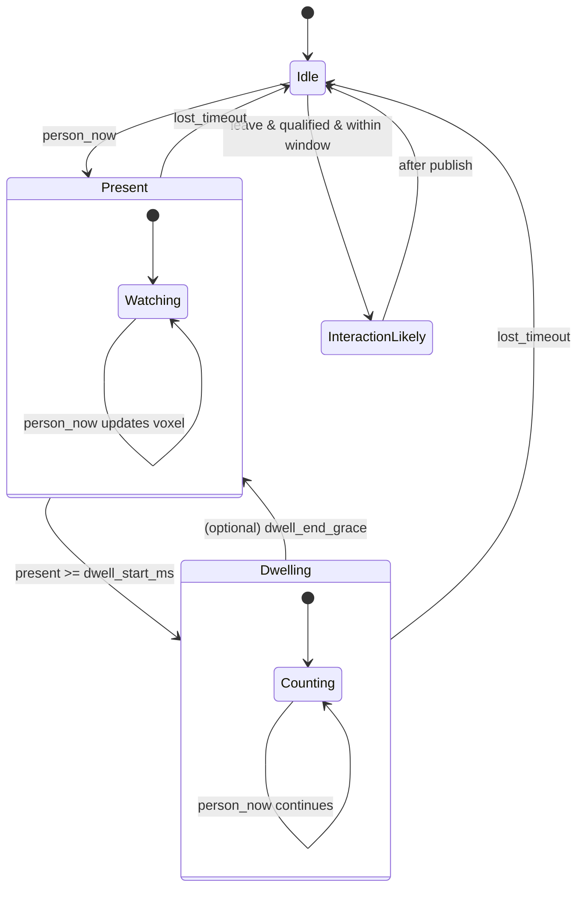

# SecuraCV Canary Vision (ESP32-C3 + Grove Vision AI V2)

Privacy-preserving optical witness firmware that publishes semantic signals over MQTT and self-registers in Home Assistant via MQTT Discovery.

## Quickstart (PlatformIO)

1. Copy `secrets/secrets.example.h` → `secrets/secrets.h`
2. Fill WiFi + MQTT fields
3. Build/Upload:
   - `pio run -t upload`
4. Monitor:
   - `pio device monitor`

## MQTT Topics

Base:
- `securacv/<device_id>/events` (non-retained)
- `securacv/<device_id>/state`  (retained)
- `securacv/<device_id>/status` (retained; availability: online/offline)

Discovery (retained):
- `homeassistant/binary_sensor/<device_id>/presence/config`
- `homeassistant/binary_sensor/<device_id>/dwelling/config`
- `homeassistant/sensor/<device_id>/confidence/config`
- `homeassistant/sensor/<device_id>/voxel/config`
- `homeassistant/sensor/<device_id>/last_event/config`
- `homeassistant/sensor/<device_id>/uptime/config`

## Presence/Dwell FSM diagram

## License
Apache-2.0 (see repository root).
