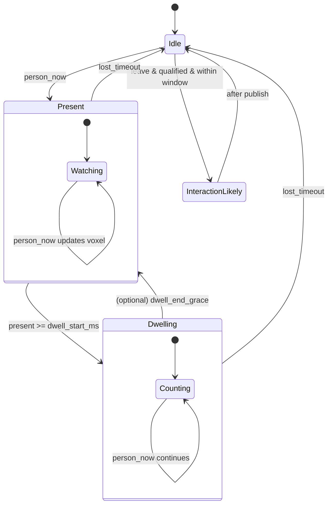

# SecuraCV Canary Vision (ESP32 host + Grove Vision AI V2)

Privacy-preserving optical witness firmware that publishes semantic signals over MQTT and self-registers in Home Assistant via MQTT Discovery. Inference runs **on the Grove Vision AI V2 module** (Himax HX6538 NPU); the ESP32 host only ever sees boxes/scores over I2C — no pixels cross the wire.

**First build? Follow the end-to-end walkthrough:** [`docs/hardware/canary_vision_getting_started.md`](../../../docs/hardware/canary_vision_getting_started.md) — unboxing → model load → flash → HA → aiming.
**Device guide (hardware reference):** [`docs/hardware/grove_vision_ai_v2_guide.md`](../../../docs/hardware/grove_vision_ai_v2_guide.md) — covers the module's **two USB-C ports** (model loading vs firmware flashing), the Grove I2C port, loading the initial AI model via SenseCraft, and recovery.
**Roadmap:** [`docs/strategy/10-grove-vision-ai-v2-program.md`](../../../docs/strategy/10-grove-vision-ai-v2-program.md)

## Supported host boards

| Build env | Host board | Hookup | I2C SDA/SCL |
|---|---|---|---|
| `canary-vision-xiao-c3` | Seeed XIAO ESP32-C3 | Stacks on the module's XIAO socket (or Grove cable) | GPIO6 / GPIO7 |
| `canary-vision-xiao-s3` | Seeed XIAO ESP32-S3 (plain) | Stacks on the module's XIAO socket (or Grove cable) — the "Vision AI V2 Kit" pairing | GPIO5 / GPIO6 |
| `canary-vision-default` | ESP32-C3 DevKitM-1 | Grove cable / jumpers | GPIO4 / GPIO5 |

Pins come from `firmware/boards/<board-id>/pins/pins.h` and are passed to `Wire.begin()` explicitly. When stacking a XIAO, both USB-C connectors must face the same direction.

## Quickstart (PlatformIO)

1. Load the **Person Detection** model onto the module once via SenseCraft (module's own USB-C port — see device guide §4)
2. Copy `secrets/secrets.example.h` → `secrets/secrets.h`
3. Fill WiFi + MQTT fields
4. Build/Upload (host board's USB-C port):
   - `pio run -e canary-vision-xiao-c3 -t upload` (pick your env from the table)
5. Monitor:
   - `pio device monitor` — a non-zero `Grove Vision AI ID=...` line confirms the I2C link

## Runtime detection settings (no rebuild for model swaps)

The detection semantics are NVS-backed and adjustable from Home Assistant —
a `select` entity plus four `number` entities appear in the device's
Configuration section:

| Setting | JSON key | Range | Why you'd change it |
|---|---|---|---|
| Watch profile | `profile` | room_presence / litter_box | One-step per-use-case preset — applies the profile's recommended tuning below and retargets the fleet beacon's detect class (person / animal) |
| Person class index | `target` | 0–255 | The loaded SSCMA model decides which class is the subject — set this after swapping models in SenseCraft |
| Score threshold | `score` | 0–100 % | Per-model confidence calibration / false-positive tuning |
| Lost timeout | `lost_ms` | 250–60000 ms | How long silence means "subject left" |
| Dwell start | `dwell_ms` | 1000–600000 ms | Sustained presence before "dwelling" |

The compiled constants in `include/canary/config.h` seed the first boot
only; live values persist across reboots and OTA installs (see
`include/canary/detect_config.h`).

**Watch profiles** (`include/canary/detect_profiles.h`) make one firmware
serve different jobs without a rebuild: `room_presence` (the default —
person detection, the classic optical witness) and `litter_box` (a
cat-detection model watching the box in an already-lit space: lower score
floor, longer lost timeout so digging doesn't fragment a visit, shorter
dwell so a real visit latches). Selecting a profile applies its preset to
the four numbers — each stays individually tunable afterward, and
re-selecting the profile restores its preset. The event vocabulary and the
signed witness record are **identical across profiles** (Invariant VI —
no new claim types); what changes is tuning, the beacon's detect class,
and how the dashboards read the same events. Litter-box alerting recipes:
[`homeassistant/automations/securacv_litterbox.yaml`](../../../homeassistant/automations/securacv_litterbox.yaml)
and
[`homeassistant/lovelace/securacv-litterbox-dashboard.yaml`](../../../homeassistant/lovelace/securacv-litterbox-dashboard.yaml).

Bench test from any MQTT client (no HA needed):

```bash
mosquitto_sub -h <broker> -t 'securacv/<device_id>/cfg/state' -v &
mosquitto_pub -h <broker> -t 'securacv/<device_id>/cfg/score/set' -m '85'
# expect the retained cfg/state to echo {"target":0,"score":85,...}
# junk is rejected without effect:
mosquitto_pub -h <broker> -t 'securacv/<device_id>/cfg/score/set' -m 'nan'
# switch the whole box to litter-box duty in one message (key or HA label):
mosquitto_pub -h <broker> -t 'securacv/<device_id>/cfg/profile/set' -m 'litter_box'
```

A ready-made dashboard for these entities ships at
[`homeassistant/lovelace/securacv-vision-dashboard.yaml`](../../../homeassistant/lovelace/securacv-vision-dashboard.yaml)
(voxel heat grid, tuning view, firmware view) with companion alert
automations at
[`homeassistant/automations/securacv_vision_presence.yaml`](../../../homeassistant/automations/securacv_vision_presence.yaml).

## Coarse optical signals (occupancy · posture · proximity)

The person-detection model returns **every** detected person box each frame, not
just one. The firmware reads them all (at zero extra inference cost — the boxes
are already in RAM after the invoke) and derives three **coarse, non-identifying**
signals, published on the retained `state` topic and surfaced as HA sensors:

| Sensor | Values | Derived from | Notes |
|---|---|---|---|
| **Occupancy** | `none / one / two / several` | count of qualifying boxes | a bucket, never an exact running tally (no household profiling) |
| **Posture** | `upright / ambiguous / horizontal` | primary box **aspect ratio** | a fall/collapse *proxy* with no pose model and no keypoints — advisory, physics-only |
| **Proximity** | `far / mid / near` | primary box **area** fraction | coarse distance band, like an RSSI trend |

These are **ordinals only** — no coordinate, angle, area, or distance is ever
published — and the **signed witness record is unchanged**: promoting any of
these into the sealed vocabulary (e.g. a sustained `posture_horizontal` fall
claim, or an honest coarse `occupants`) is a spec-first change per Invariant VI.
The raw `bbox` still rides the non-sealed live/aim telemetry for aiming, exactly
as before. Thresholds seed from `include/canary/vision/optical_features.h`; the
pure coarsening is host-unit-tested in
[`firmware/tests_host/test_optical_features.cpp`](../../tests_host/test_optical_features.cpp),
and the signal vocabulary + invariant mapping live in
[`spec/canary_free_signals_v0.md`](../../../spec/canary_free_signals_v0.md) §3.9.

## Aim assist (boxes-only live view)

An HA switch (`Aim assist`, off by default) streams the best person box —
coordinates, score, voxel cell, **never pixels** — at ~5 Hz on
`securacv/<device_id>/aim` (non-retained) so the dashboard's *Aim camera*
card (`custom:securacv-aim-card`) can render a live wireframe for aiming
and threshold tuning after the device is mounted. Empty frames publish at
1 Hz so the card clears; the switch auto-offs after 10 minutes so a
forgotten toggle can't stream box telemetry forever. Constants in
`include/canary/config.h` (`AIM_*`).

## Runtime robustness (ESP32-S3 tree parity)

Ported from the ACTIVE `firmware/canary` (ESP32-S3) tree, 2026-07:

- **Supervised WiFi STA** — non-blocking reconnect with exponential backoff
  (2 s → 30 s cap) on link loss, and a reboot as the recovery of last resort
  after a 5-minute outage. The blocking MQTT reconnect defers to this
  supervisor whenever the link is down instead of spinning.
- **WiFi power policy** — optional modem sleep (`WIFI_POWER_SAVE`) and a TX
  power cap (`WIFI_TX_POWER_QDBM`), off/default by default; see
  `include/canary/config.h`.
- **Heap health monitor** — S3-tree thresholds (30 k warn / 15 k critical /
  10 k emergency, 5 k hysteresis). Under pressure the inference cadence is
  stretched (2× critical, 5× emergency) so SSCMA invokes never OOM the
  device; the level rides the status heartbeat.
- **HA diagnostic entities** — WiFi RSSI and free heap appear under the
  device's Diagnostic section via MQTT discovery.

## MQTT Topics

Base:
- `securacv/<device_id>/events` (non-retained)
- `securacv/<device_id>/state`  (retained)
- `securacv/<device_id>/status` (retained; availability: online/offline)
- `securacv/<device_id>/cfg/state` (retained; live detection settings + watch profile)
- `securacv/<device_id>/cfg/{target,score,lost,dwell,profile}/set` (commands)

Discovery (retained):
- `homeassistant/binary_sensor/<device_id>/presence/config`
- `homeassistant/binary_sensor/<device_id>/dwelling/config`
- `homeassistant/sensor/<device_id>/confidence/config`
- `homeassistant/sensor/<device_id>/voxel/config`
- `homeassistant/sensor/<device_id>/occupancy/config`
- `homeassistant/sensor/<device_id>/posture/config`
- `homeassistant/sensor/<device_id>/proximity/config`
- `homeassistant/sensor/<device_id>/last_event/config`
- `homeassistant/sensor/<device_id>/uptime/config`

## Presence/Dwell FSM diagram



## License
Apache-2.0 (see repository root).
