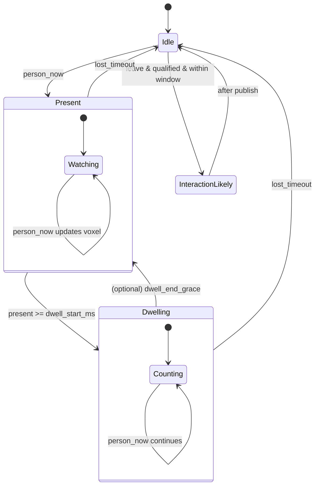

# SecuraCV Canary Vision (ESP32 host + Grove Vision AI V2)

Privacy-preserving optical witness firmware that publishes semantic signals over MQTT and self-registers in Home Assistant via MQTT Discovery. Inference runs **on the Grove Vision AI V2 module** (Himax HX6538 NPU); the ESP32 host only ever sees boxes/scores over I2C — no pixels cross the wire.

**Device guide (read first for hardware setup):** [`docs/hardware/grove_vision_ai_v2_guide.md`](../../../docs/hardware/grove_vision_ai_v2_guide.md) — covers the module's **two USB-C ports** (model loading vs firmware flashing), the Grove I2C port, loading the initial AI model via SenseCraft, and recovery.
**Roadmap:** [`docs/strategy/10-grove-vision-ai-v2-program.md`](../../../docs/strategy/10-grove-vision-ai-v2-program.md)

## Supported host boards

| Build env | Host board | Hookup | I2C SDA/SCL |
|---|---|---|---|
| `canary-vision-xiao-c3` | Seeed XIAO ESP32-C3 | Stacks on the module's XIAO socket (or Grove cable) | GPIO6 / GPIO7 |
| `canary-vision-xiao-s3` | Seeed XIAO ESP32-S3 (plain) | Stacks on the module's XIAO socket (or Grove cable) — the "Vision AI V2 Kit" pairing | GPIO5 / GPIO6 |
| `canary-vision-default` | ESP32-C3 DevKitM-1 | Grove cable / jumpers | GPIO4 / GPIO5 |

Pins come from `firmware/boards/<board-id>/pins/pins.h` and are passed to `Wire.begin()` explicitly. When stacking a XIAO, both USB-C connectors must face the same direction.

## Quickstart (PlatformIO)

1. Load the **Person Detection** model onto the module once via SenseCraft (module's own USB-C port — see device guide §4)
2. Copy `secrets/secrets.example.h` → `secrets/secrets.h`
3. Fill WiFi + MQTT fields
4. Build/Upload (host board's USB-C port):
   - `pio run -e canary-vision-xiao-c3 -t upload` (pick your env from the table)
5. Monitor:
   - `pio device monitor` — a non-zero `Grove Vision AI ID=...` line confirms the I2C link

## MQTT Topics

Base:
- `securacv/<device_id>/events` (non-retained)
- `securacv/<device_id>/state`  (retained)
- `securacv/<device_id>/status` (retained; availability: online/offline)

Discovery (retained):
- `homeassistant/binary_sensor/<device_id>/presence/config`
- `homeassistant/binary_sensor/<device_id>/dwelling/config`
- `homeassistant/sensor/<device_id>/confidence/config`
- `homeassistant/sensor/<device_id>/voxel/config`
- `homeassistant/sensor/<device_id>/last_event/config`
- `homeassistant/sensor/<device_id>/uptime/config`

## Presence/Dwell FSM diagram

## License
Apache-2.0 (see repository root).
